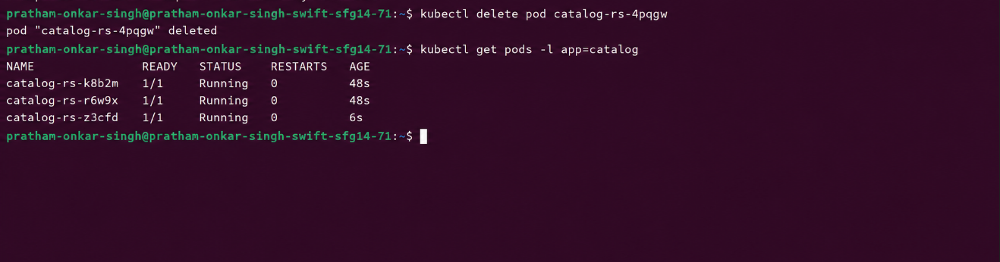
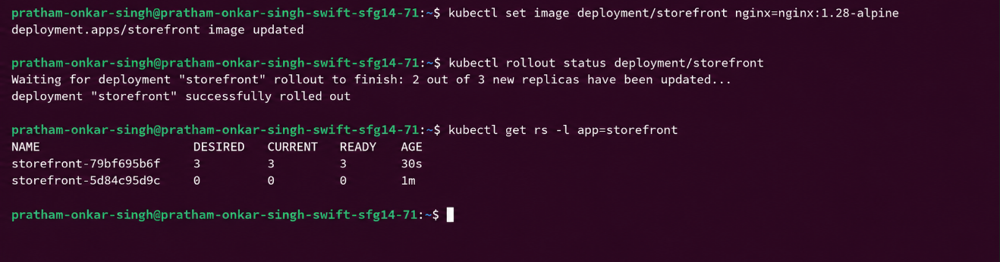
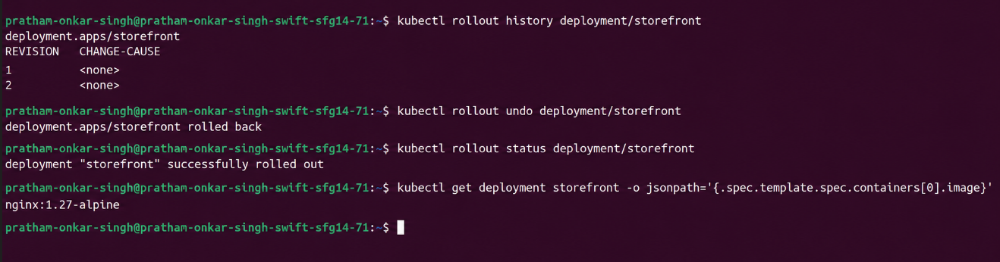
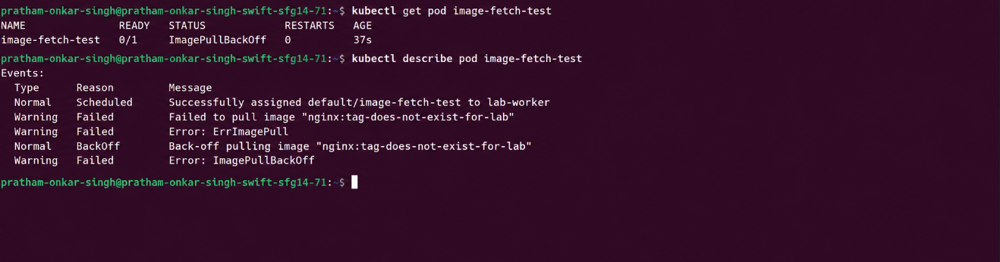
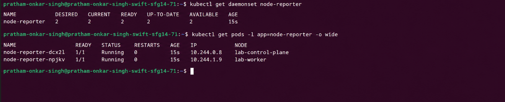

# Kubernetes Workloads: Pods, ReplicaSets, Deployments and DaemonSets

**Student:** Pratham Onkar Singh
**Roll No.:** 24bcs10136

This exercise explores the controllers Kubernetes uses to keep applications available. The
examples use small `nginx` and `busybox` workloads so that the behaviour is easy to observe.

> The command blocks and images below are **reference/expected output**. Run the commands on
> your own cluster and replace them with your own captured output before treating this as a lab record.

## Objectives

- Launch and inspect an unmanaged Pod.
- Use a ReplicaSet to maintain a chosen number of replicas.
- Perform an update and rollback through a Deployment.
- Diagnose a Pod that cannot pull its container image.
- Schedule one Pod per node using a DaemonSet.

## Controller relationship

```
Deployment
    └─ ReplicaSet
         └─ Pods
```

A Pod is the smallest unit Kubernetes schedules. A ReplicaSet continuously compares the
actual number of matching Pods with its desired replica count. A Deployment adds revision
tracking and controlled replacement of ReplicaSets, which makes safe application changes and
rollbacks possible.


## 1. Standalone Pod

The file [`manifests/pod.yaml`](manifests/pod.yaml) creates a single web Pod.

```bash
kubectl apply -f manifests/pod.yaml
kubectl get pod web-check -o wide
```

Example result:

```text
NAME        READY   STATUS    RESTARTS   AGE   IP            NODE
web-check   1/1     Running   0          18s   10.244.1.11   lab-worker
```

This Pod has no controller. Deleting it removes it permanently, so it is useful for a quick
test but not for a service that must remain available.

---

## 2. ReplicaSet: replica count and recovery

Create the ReplicaSet and list the Pods it owns:

```bash
kubectl apply -f manifests/replicaset.yaml
kubectl get rs catalog-rs
kubectl get pods -l app=catalog
```

```text
NAME         DESIRED   CURRENT   READY   AGE
catalog-rs   3         3         3       22s

NAME               READY   STATUS    RESTARTS   AGE
catalog-rs-4pqgw   1/1     Running   0          22s
catalog-rs-k8b2m   1/1     Running   0          22s
catalog-rs-r6w9x   1/1     Running   0          22s
```

### Self-healing check

Delete one of the generated Pods, then immediately ask for the matching Pods again:

```bash
kubectl delete pod catalog-rs-4pqgw
kubectl get pods -l app=catalog
```

The controller creates a replacement because the live count briefly falls below three. The
new Pod has a different suffix and a younger age.



### Scaling

```bash
kubectl scale rs/catalog-rs --replicas=5
kubectl get rs catalog-rs
```

Scaling changes the desired state to five; the ReplicaSet then adds two Pods. For a persistent
configuration change, update `spec.replicas` in the YAML and apply the file again.

---

## 3. Deployment: rolling update and rollback

Apply the Deployment and inspect the objects carrying the `app=storefront` label:

```bash
kubectl apply -f manifests/deployment.yaml
kubectl get deployment,rs,pods -l app=storefront
```

The Deployment creates a ReplicaSet, which in turn creates three Pods. Update the container
image and watch Kubernetes replace the old replica set gradually:

```bash
kubectl set image deployment/storefront nginx=nginx:1.28-alpine
kubectl rollout status deployment/storefront
kubectl get rs -l app=storefront
```



The newly created ReplicaSet grows while the previous one is reduced. Keeping the previous
revision is what permits a quick rollback.

```bash
kubectl rollout history deployment/storefront
kubectl rollout undo deployment/storefront
kubectl rollout status deployment/storefront
kubectl get deployment storefront -o jsonpath='{.spec.template.spec.containers[0].image}'
echo
```



---

## 4. Troubleshooting `ImagePullBackOff`

[`manifests/broken-pod.yaml`](manifests/broken-pod.yaml) intentionally references a nonexistent
image tag. Create it and inspect the status:

```bash
kubectl apply -f manifests/broken-pod.yaml
kubectl get pod image-fetch-test
kubectl describe pod image-fetch-test
```

Expected status:

```text
NAME               READY   STATUS             RESTARTS   AGE
image-fetch-test   0/1     ImagePullBackOff   0          37s
```

`kubectl describe` includes the event history, such as `ErrImagePull` and the registry message.
Logs are unavailable in this case because the container never started. For a `CrashLoopBackOff`,
by contrast, use `kubectl logs <pod-name>` because the container did start and then exited.



| Pod status | Usual next step |
| --- | --- |
| `Pending` | Check scheduling events and available resources. |
| `ContainerCreating` | Wait briefly; inspect events if it persists. |
| `ImagePullBackOff` | Verify image name/tag and registry credentials. |
| `CrashLoopBackOff` | Inspect container logs and exit configuration. |
| `Running` | The container is ready. |

---

## 5. DaemonSet: one agent per node

The DaemonSet in [`manifests/daemonset.yaml`](manifests/daemonset.yaml) is a lightweight
node-reporting example. It includes a control-plane toleration so that a typical two-node
Kind cluster schedules one copy on each node.

```bash
kubectl apply -f manifests/daemonset.yaml
kubectl get daemonset node-reporter
kubectl get pods -l app=node-reporter -o wide
```

```text
NAME            DESIRED   CURRENT   READY   UP-TO-DATE   AVAILABLE   AGE
node-reporter   2         2         2       2            2           15s
```

The desired count follows the number of eligible nodes rather than a manually supplied replica
count. Adding an eligible node causes the DaemonSet to schedule another Pod automatically.



## Cleanup

Remove all resources created by this lab:

```bash
kubectl delete -f manifests/
```

## Key takeaways

- A bare Pod is not self-healing.
- ReplicaSets maintain a replica count through label matching.
- Deployments manage ReplicaSets and retain history for controlled updates and rollback.
- Events from `kubectl describe` are central to diagnosing startup failures.
- DaemonSets use nodes as their scheduling target: one matching Pod per eligible node.
