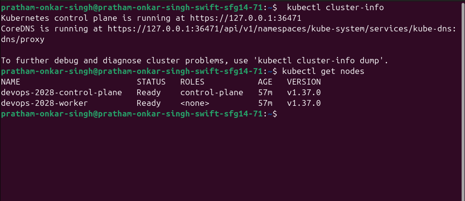
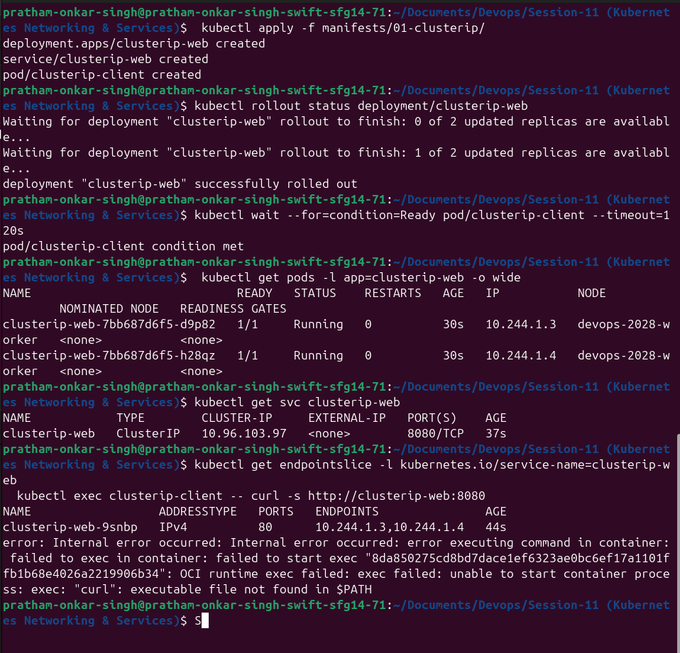
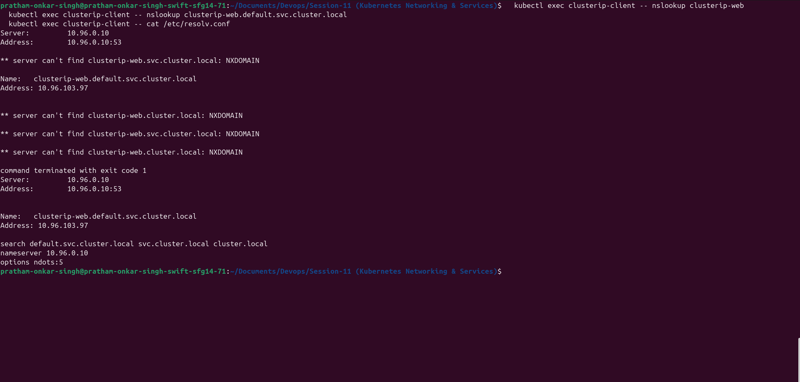
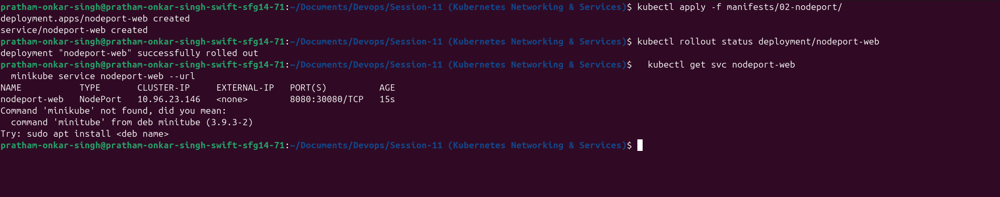
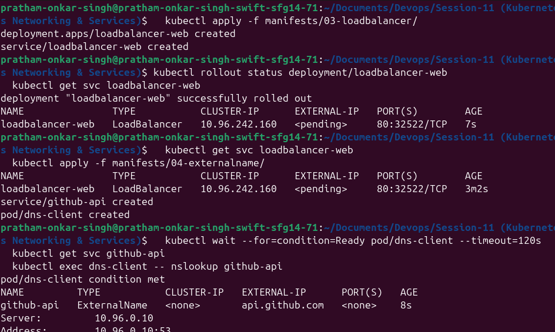
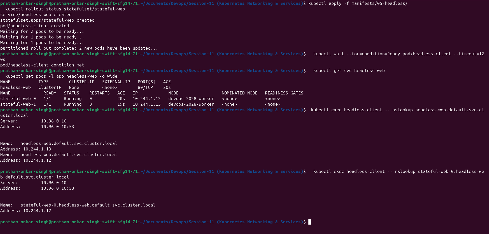
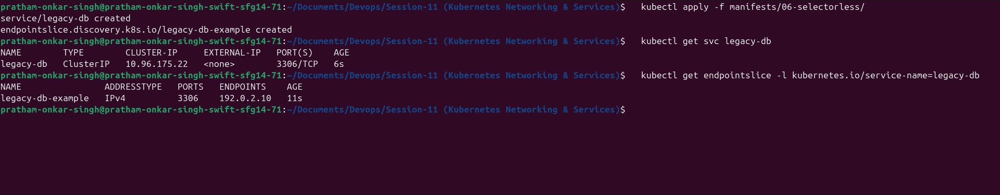

# Kubernetes Networking and Services

**Student:** Pratham Onkar Singh

**Roll No.:** 24bcs10136
**Session:** 11 — Kubernetes Networking & Services

## Aim

This lab explores how Kubernetes Services provide stable discovery for workloads whose Pod IPs may change. It includes the common Service types, DNS lookup behaviour, direct StatefulSet discovery, and a selectorless Service backed by an EndpointSlice.

> Run the commands on your own cluster and capture the resulting terminal output in `screenshots/`. Addresses, generated Pod names, and NodePort/LoadBalancer values vary by environment.

### Cluster readiness



## Port roles at a glance

```text
client -> nodeIP:nodePort -> serviceIP:port -> podIP:targetPort -> application
```

| Setting | Purpose |
|---|---|
| `containerPort` | Documents the port offered by the container; it does not publish the application. |
| `targetPort` | The port on selected backend Pods. |
| `port` | The virtual Service port used by cluster clients. |
| `nodePort` | A high port exposed on every node for a NodePort Service. |

For example, the NodePort manifest maps `30080 → 8080 → 80`.

## Repository layout

```text
manifests/
├── 01-clusterip/
├── 02-nodeport/
├── 03-loadbalancer/
├── 04-externalname/
├── 05-headless/
└── 06-selectorless/
screenshots/                 # add captures from this lab here
```

## 1. ClusterIP: internal application access

`ClusterIP` is the standard Service type. It gives clients inside the cluster a stable virtual IP and DNS name, while the Service selects currently ready Pods.

```bash
kubectl apply -f manifests/01-clusterip/
kubectl get pods -l app=clusterip-web -o wide
kubectl get service clusterip-web
kubectl get endpointslice -l kubernetes.io/service-name=clusterip-web
kubectl exec clusterip-client -- curl -s http://clusterip-web:8080
```

The selector (`app: clusterip-web`) must agree with the labels on the Deployment template. A mismatch produces a Service with no usable backends.



### DNS forms

From the `default` namespace, these names identify the same Service:

```text
clusterip-web
clusterip-web.default
clusterip-web.default.svc.cluster.local
```

The general fully qualified form is `<service>.<namespace>.svc.<cluster-domain>`.

```bash
kubectl exec clusterip-client -- nslookup clusterip-web
kubectl exec clusterip-client -- nslookup clusterip-web.default.svc.cluster.local
```



## 2. NodePort: reach a Service through a node

NodePort retains ClusterIP behaviour and also reserves a port on every cluster node.

```bash
kubectl apply -f manifests/02-nodeport/
kubectl get service nodeport-web
minikube service nodeport-web --url
```

When node networking is reachable, use `http://<node-ip>:30080`. With Minikube's Docker driver, the node may be isolated from the host; `minikube service ... --url` is the reliable local approach.



## 3. LoadBalancer: request an external address

```bash
kubectl apply -f manifests/03-loadbalancer/
kubectl get service loadbalancer-web --watch
```

Cloud environments normally provide the external address through their load-balancer integration. On Minikube, leave this running in a separate terminal:

```bash
minikube tunnel
```

An `EXTERNAL-IP` of `<pending>` locally means that no controller has fulfilled the request yet; it is not an error in the Service selector.

## 4. ExternalName: an in-cluster DNS alias

ExternalName does not create a virtual IP, selectors, or endpoints. Instead, it returns a DNS CNAME to an outside name.

```bash
kubectl apply -f manifests/04-externalname/
kubectl get service github-api
kubectl exec dns-client -- nslookup github-api
```

The alias here points to `api.github.com`. It is DNS indirection rather than an HTTP proxy, so TLS and the HTTP `Host` header still need to match the external server.



## 5. Headless Service and StatefulSet discovery

A headless Service uses `clusterIP: None`. DNS returns the ready Pod records instead of one Service virtual IP. This makes it useful alongside a StatefulSet, where ordinal Pod names are retained.

```bash
kubectl apply -f manifests/05-headless/
kubectl rollout status statefulset/stateful-web
kubectl get pods -l app=headless-web -o wide
kubectl get service headless-web
kubectl exec headless-client -- nslookup headless-web.default.svc.cluster.local
kubectl exec headless-client -- nslookup stateful-web-0.headless-web.default.svc.cluster.local
```

Deleting a Deployment Pod creates a replacement with a new generated name. Deleting `stateful-web-0` causes the StatefulSet to restore that ordinal identity.



## 6. Selectorless Service with EndpointSlice

Some backends are outside Kubernetes, such as a legacy database. The selectorless Service in this lab is associated with an EndpointSlice instead of Pod labels.

```bash
kubectl apply -f manifests/06-selectorless/
kubectl get service legacy-db
kubectl get endpointslice -l kubernetes.io/service-name=legacy-db
```

`192.0.2.10` is intentionally a documentation-only address. Replace it only with a backend you own and are permitted to reach; do not expect the sample address to accept connections.



## CoreDNS and search paths

CoreDNS supplies Service discovery. Inspect the resolver settings actually assigned to a Pod rather than assuming values:

```bash
kubectl get pods -n kube-system -l k8s-app=kube-dns
kubectl exec clusterip-client -- cat /etc/resolv.conf
```

A common configuration includes search suffixes such as `default.svc.cluster.local`, `svc.cluster.local`, and `cluster.local`. The `ndots` setting affects whether a short external-looking name is tried with these suffixes before it is queried as absolute.

## Workload controller comparison

| Controller | Suitable workload | Identity | Typical networking |
|---|---|---|---|
| Deployment | Stateless APIs/web apps | Disposable generated Pod name | Standard ClusterIP Service |
| StatefulSet | Databases or clustered members | Stable ordinal, e.g. `stateful-web-0` | Headless Service for per-Pod DNS |
| DaemonSet | Node agents such as log collectors | One Pod per eligible node | Usually no public Service |

## Picking the appropriate Service

```text
Internal application traffic       -> ClusterIP
Direct discovery of Stateful Pods  -> Headless Service
External DNS alias                 -> ExternalName
Simple/local external access       -> NodePort or port-forward
Cloud TCP/UDP public endpoint      -> LoadBalancer
Many HTTP applications             -> Gateway/Ingress + ClusterIP backends
```

Giving every HTTP microservice its own cloud load balancer can create unnecessary cost and public exposure. A shared Layer 7 Gateway or Ingress commonly routes hostnames/paths to internal ClusterIP Services.

## Cleanup

```bash
kubectl delete -f manifests/06-selectorless/ --ignore-not-found
kubectl delete -f manifests/05-headless/ --ignore-not-found
kubectl delete -f manifests/04-externalname/ --ignore-not-found
kubectl delete -f manifests/03-loadbalancer/ --ignore-not-found
kubectl delete -f manifests/02-nodeport/ --ignore-not-found
kubectl delete -f manifests/01-clusterip/ --ignore-not-found
```

## Service type comparison

| Service type | Virtual ClusterIP | External reachability | Best fit |
|---|---:|---|---|
| ClusterIP | Yes | Internal only by default | Communication between applications inside the cluster |
| NodePort | Yes | Node address plus a high port | Local development and simple non-cloud exposure |
| LoadBalancer | Yes | Provided by a cloud or local LB implementation | A dedicated public TCP/UDP endpoint |
| ExternalName | No | DNS alias only | Referring to an external DNS name from inside the cluster |
| Headless | `None` | No single virtual IP | Stateful workload discovery and direct Pod DNS records |
