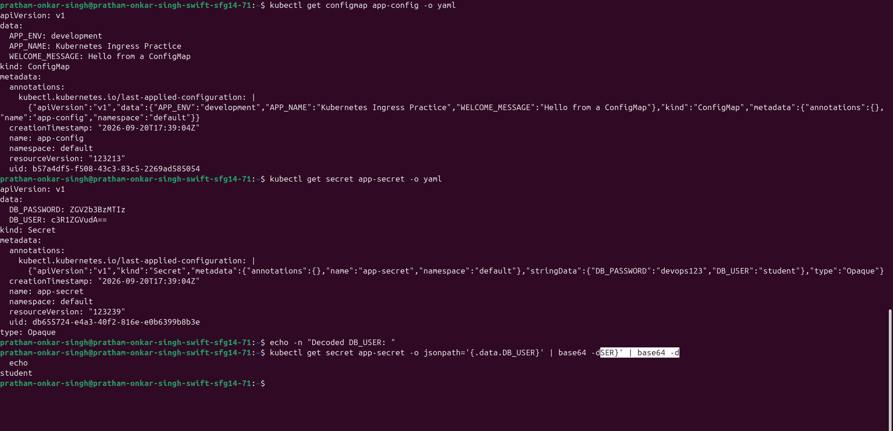
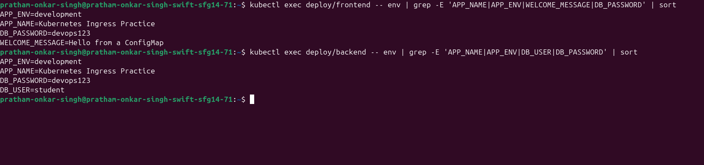
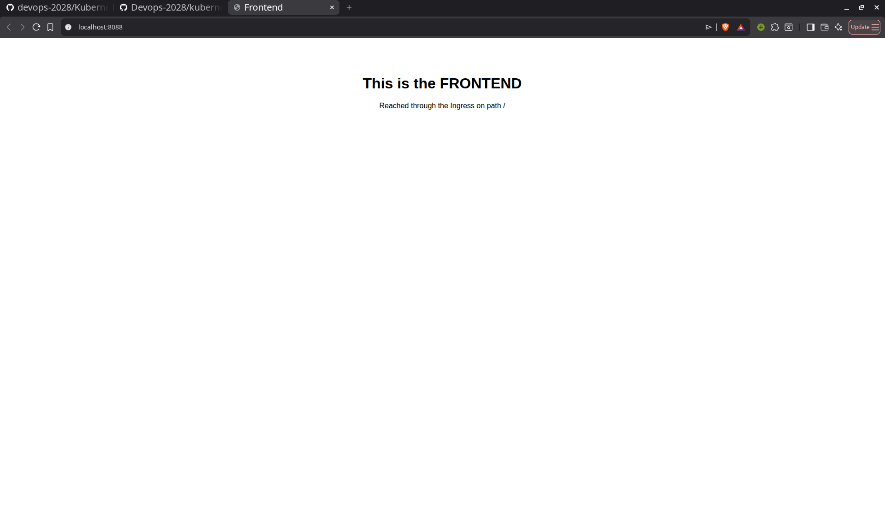

# Kubernetes Ingress, ConfigMaps and Secrets

**Name:** Pratham Onkar Singh

**Enrollment number:** 24BCS10136

## Homework tasks

- Install an Ingress controller.
- Create a ConfigMap and use it in an application.
- Create a Secret and use it in an application.
- Deploy two applications and inject the configuration into them.
- Create an Ingress that routes to both applications.

All Kubernetes YAML is in [manifests](manifests). The screenshots below are captured from the commands run against the local kind cluster.

## The idea

- A **ConfigMap** stores non-sensitive key/value configuration.
- A **Secret** stores sensitive values such as passwords.
- An **Ingress** is one HTTP entry point that routes requests to Services by path or hostname.

ConfigMaps and Secrets keep configuration out of the container image. The same image can therefore run in different environments with different configuration.

---

## 0. Install the Ingress controller

An Ingress resource only defines routing rules. An Ingress controller reads those rules and performs the actual routing. This assignment uses the NGINX Ingress controller for kind.

```bash
kubectl apply -f https://raw.githubusercontent.com/kubernetes/ingress-nginx/controller-v1.11.3/deploy/static/provider/kind/deploy.yaml

kubectl wait --namespace ingress-nginx \
  --for=condition=ready pod \
  --selector=app.kubernetes.io/component=controller --timeout=180s
```

```bash
kubectl get pods -n ingress-nginx
```


The two `Completed` Pods are one-time admission Jobs; this is expected. The controller Pod must be `Running` before applying the Ingress.

The kind cluster is configured with a host port mapping to expose port 80 through `localhost:8088`:

```yaml
extraPortMappings:
  - containerPort: 80
    hostPort: 8088
```

---

## 1. ConfigMap

[manifests/configmap.yaml](manifests/configmap.yaml) holds the application name, environment, and welcome message:

```yaml
apiVersion: v1
kind: ConfigMap
metadata:
  name: app-config
data:
  APP_NAME: "Kubernetes Ingress Practice"
  APP_ENV: "development"
  WELCOME_MESSAGE: "Hello from a ConfigMap"
```

Apply and inspect it:

```bash
kubectl apply -f manifests/configmap.yaml
kubectl get configmap app-config -o yaml
```

The values are readable plain text, so ConfigMaps must never contain passwords or other sensitive data.

## 2. Secret

[manifests/secret.yaml](manifests/secret.yaml) defines practice-only database credentials:

```yaml
apiVersion: v1
kind: Secret
metadata:
  name: app-secret
type: Opaque
stringData:
  DB_USER: "student"
  DB_PASSWORD: "devops123"
```

`stringData` lets the manifest use normal text; Kubernetes stores it in the Secret's `data` field as base64. The live output and decoded username are shown below.

```bash
kubectl get secret app-secret -o yaml
kubectl get secret app-secret -o jsonpath='{.data.DB_USER}' | base64 -d
```



Base64 is encoding, **not encryption**. A Secret avoids placing credentials in the image or Deployment manifest, but access should still be restricted with RBAC and real environments should use encryption at rest or an external secret manager.

---

## 3. Deploy both applications and inject configuration

The two NGINX Deployments and their ClusterIP Services are in [manifests/frontend.yaml](manifests/frontend.yaml) and [manifests/backend.yaml](manifests/backend.yaml). Their HTML pages are ConfigMaps mounted from [manifests/pages-configmap.yaml](manifests/pages-configmap.yaml).

The frontend imports all ConfigMap values and selects only `DB_PASSWORD` from the Secret:

```yaml
envFrom:
  - configMapRef:
      name: app-config
env:
  - name: DB_PASSWORD
    valueFrom:
      secretKeyRef:
        name: app-secret
        key: DB_PASSWORD
```

The backend imports both whole objects:

```yaml
envFrom:
  - configMapRef:
      name: app-config
  - secretRef:
      name: app-secret
```

Deploy all manifests and wait for the Pods:

```bash
kubectl apply -f manifests/
kubectl rollout status deployment/frontend
kubectl rollout status deployment/backend
```

Verify the environment variables inside each live container:

```bash
kubectl exec deploy/frontend -- env | grep -E 'APP_NAME|APP_ENV|WELCOME_MESSAGE|DB_PASSWORD' | sort
kubectl exec deploy/backend -- env | grep -E 'APP_NAME|APP_ENV|DB_USER|DB_PASSWORD' | sort
```



`envFrom` imports every key. `secretKeyRef` picks a single Secret key. Environment variables are read when a container starts, so after a ConfigMap update a Deployment needs a restart, for example `kubectl rollout restart deployment/frontend`.

The `frontend-page` and `backend-page` ConfigMaps demonstrate a second ConfigMap use: a whole `index.html` file mounted into `/usr/share/nginx/html`. Mounted ConfigMap files can be used for configuration files such as `nginx.conf` as well as application content.

---

## 4. Ingress routing

[manifests/ingress.yaml](manifests/ingress.yaml) sends `/` to the frontend Service and `/api` to the backend Service.

```yaml
apiVersion: networking.k8s.io/v1
kind: Ingress
metadata:
  name: app-ingress
  annotations:
    nginx.ingress.kubernetes.io/rewrite-target: /
spec:
  ingressClassName: nginx
  rules:
    - http:
        paths:
          - path: /
            pathType: Prefix
            backend:
              service:
                name: frontend
                port:
                  number: 80
          - path: /api
            pathType: Prefix
            backend:
              service:
                name: backend
                port:
                  number: 80
```

```bash
kubectl get ingress
curl -s http://localhost:8088/ | grep -o '<h1>.*</h1>'
curl -s http://localhost:8088/api | grep -o '<h1>.*</h1>'
```


`ingressClassName: nginx` selects the controller. `pathType: Prefix` matches a path and anything below it. The NGINX-specific `rewrite-target` annotation strips `/api` before the backend receives the request, allowing the backend's NGINX server to serve its `/` page.

The same host and port serve two different applications based on the URL path:




## Ingress compared with a Service

| | Service (NodePort or LoadBalancer) | Ingress |
|---|---|---|
| Works at | TCP level | HTTP level |
| Routes by | Port | Hostname and URL path |
| Apps per entry point | One | Many |
| TLS | Handled by the app | Handled by the Ingress controller |
| Needs a controller | No | Yes |

## Clean up

```bash
kubectl delete -f manifests/
kubectl delete -f https://raw.githubusercontent.com/kubernetes/ingress-nginx/controller-v1.11.3/deploy/static/provider/kind/deploy.yaml
```

## Key takeaways

- ConfigMaps and Secrets separate application configuration from container images.
- A Secret is base64-encoded, not encrypted.
- `envFrom` imports all keys; `secretKeyRef` imports one selected key.
- An Ingress needs a controller and can expose multiple Services through one host and port.
