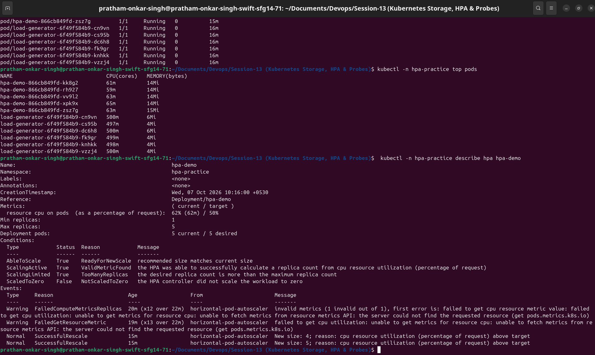
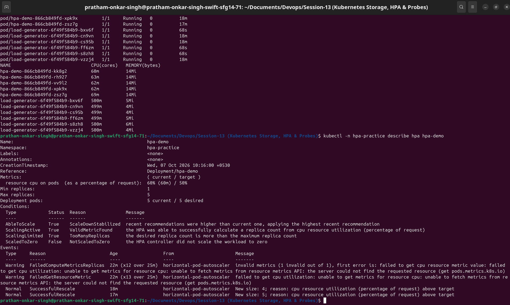

# HPA Hands-on

This exercise deploys Nginx with a 100m CPU request and an HPA target of 50% CPU. The HPA can scale from one to five replicas. CPU utilization is calculated against each container's CPU request, not the node's total CPU.

## Scaling Configuration

| Setting | Value |
|---|---|
| Target workload | `Deployment/hpa-demo` |
| CPU request per Nginx Pod | `100m` |
| CPU target | `50%` (50m average CPU usage) |
| Minimum replicas | `1` |
| Maximum replicas | `5` |
| Metrics source | Metrics Server |

## Deploy and verify

```bash
kubectl apply -f namespace.yaml -f deployment.yaml -f service.yaml -f hpa.yml
kubectl -n hpa-practice rollout status deployment/hpa-demo
kubectl -n hpa-practice get hpa
kubectl -n hpa-practice get pods
kubectl -n hpa-practice top pods
kubectl -n hpa-practice describe hpa hpa-demo
```

The HPA can initially show `<unknown>` while Metrics Server gathers its first sample. Wait a minute and run the verification commands again.

The screenshot shows the Nginx and load-generator Pods running, live CPU values from `kubectl top pods`, and the HPA details.



## Generate load and observe scaling

```bash
kubectl -n hpa-practice apply -f load-generator.yaml
kubectl -n hpa-practice scale deployment/load-generator --replicas=6
kubectl -n hpa-practice get hpa,pods -w
kubectl -n hpa-practice top pods
kubectl -n hpa-practice describe hpa hpa-demo
```

The load generator runs multiple continuous `wget` loops against `hpa-demo-service`. When average CPU exceeds 50m (50% of the 100m request), HPA increases desired replicas. After removing load, the default scale-down stabilization period delays downscaling.

## Observed Scale-Up

The HPA observed CPU utilization above its target and increased the Deployment to its five-Pod maximum. The HPA events report `SuccessfulRescale` actions from 1 to 4 Pods and then from 4 to 5 Pods.



## Captured output

The command evidence is saved in [baseline.txt](outputs/baseline.txt) and [load-scaling.txt](outputs/load-scaling.txt). Screenshots in `../images/` show deployment verification and scaling.

## Cleanup

```bash
kubectl delete namespace hpa-practice
```
