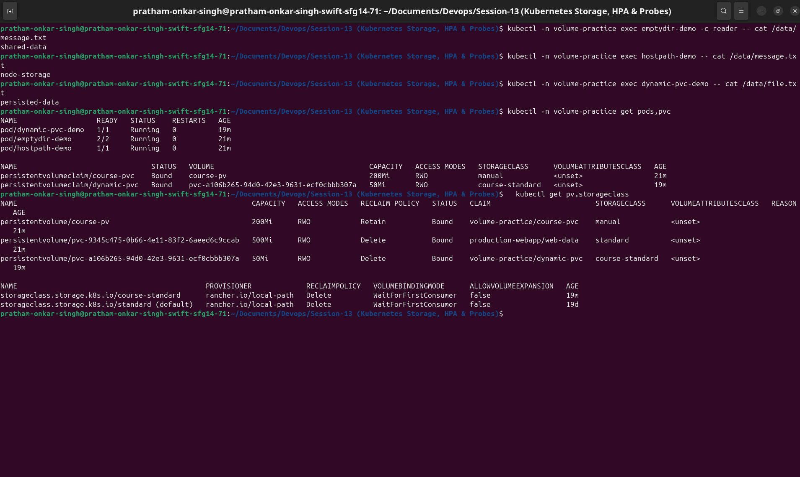
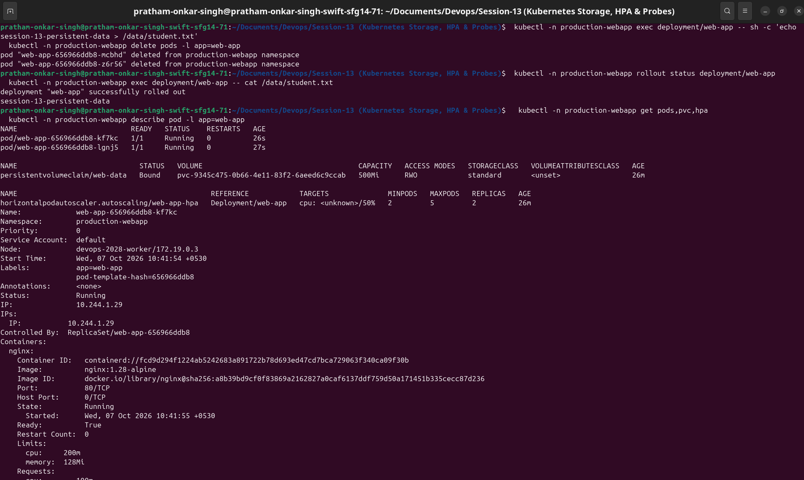

# Session 13: Kubernetes Storage, HPA & Probes

This repository documents hands-on work with Kubernetes storage, Horizontal Pod Autoscaling (HPA), and application health probes. All examples were verified on a local Kind cluster using Nginx and Kubernetes-native manifests.

## Assignment Deliverables

| Area | What is included | Evidence |
|---|---|---|
| [Kubernetes volumes](01-kubernetes-volumes/README.md) | `emptyDir`, `hostPath`, PV, PVC, StorageClass, and dynamic provisioning | Bound claims and persisted files |
| [HPA hands-on](02-hpa/README.md) | Nginx Deployment, Service, `autoscaling/v2` HPA, and load generator | CPU metrics and scale-up events |
| [Mini project](mini-project/README.md) | Nginx app with PVC, all three probes, Service, HPA, and load generator | PVC persistence after Pod replacement |

## Architecture

```text
Client --> Service --> Nginx Pods
                       |-- startup, readiness, and liveness probes
                       |-- PVC --> PersistentVolume

Metrics Server --> HPA --> Deployment replica count
```

## Key Outcomes

| Topic | Verified result |
|---|---|
| Shared temporary storage | Two containers read the same `emptyDir` file: `shared-data` |
| Node-mounted storage | The `hostPath` Pod wrote and read `node-storage` |
| Persistent storage | Static and dynamically provisioned claims reached `Bound` state |
| HPA scaling | CPU rose above the 50% target and the HPA scaled Nginx from 1 to 5 Pods |
| PVC durability | `session-13-persistent-data` remained after application Pods were replaced |

## Prerequisites

```bash
kubectl cluster-info
kubectl get nodes
kubectl get storageclass
kubectl top nodes
```

Metrics Server must be available for `kubectl top` and CPU-based HPA. On Minikube, run `minikube addons enable metrics-server`; Kind users can install Metrics Server before continuing.

## Run Order

```bash
kubectl apply -f 01-kubernetes-volumes/
kubectl apply -f 02-hpa/
kubectl -n hpa-practice rollout status deployment/hpa-demo
kubectl apply -f mini-project/
kubectl -n production-webapp rollout status deployment/web-app
```

Use the cleanup commands in each exercise README after collecting evidence.

## Verification Evidence

The terminal captures below correspond to the documented commands and observed results.

| Screenshot | File |
|---|---|
| Volume types, PVs, PVCs, and StorageClasses | `images/s13-volumes-verification.png` |
| HPA baseline: deployment, HPA, Pods, and CPU metrics | `images/s13-hpa-deploy-verify.png` |
| HPA under load: CPU, scaled Pods, and HPA events | `images/s13-hpa-load-scaling.png` |
| Mini-project persistence and probes | `images/s13-mini-persistence-probes.png` |

### Volume Verification



### HPA Verification and Scaling


### Mini-Project Persistence and Probes



## Probe Behaviour at a Glance

| Probe | Purpose | On failure |
|---|---|---|
| Startup | Gives a slow application time to boot | Kubernetes restarts the container after the threshold |
| Readiness | Decides if a Pod receives Service traffic | Pod is removed from ready endpoints |
| Liveness | Detects a stuck running container | Kubernetes restarts the container |

Startup probe success enables readiness and liveness probing. A Pod can be `Running` but not `Ready`.
