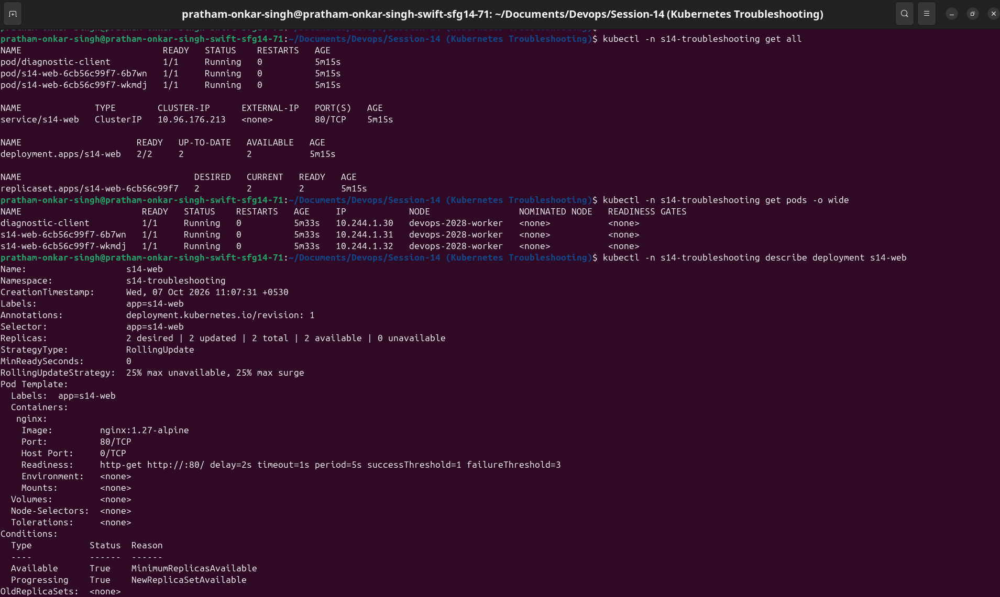
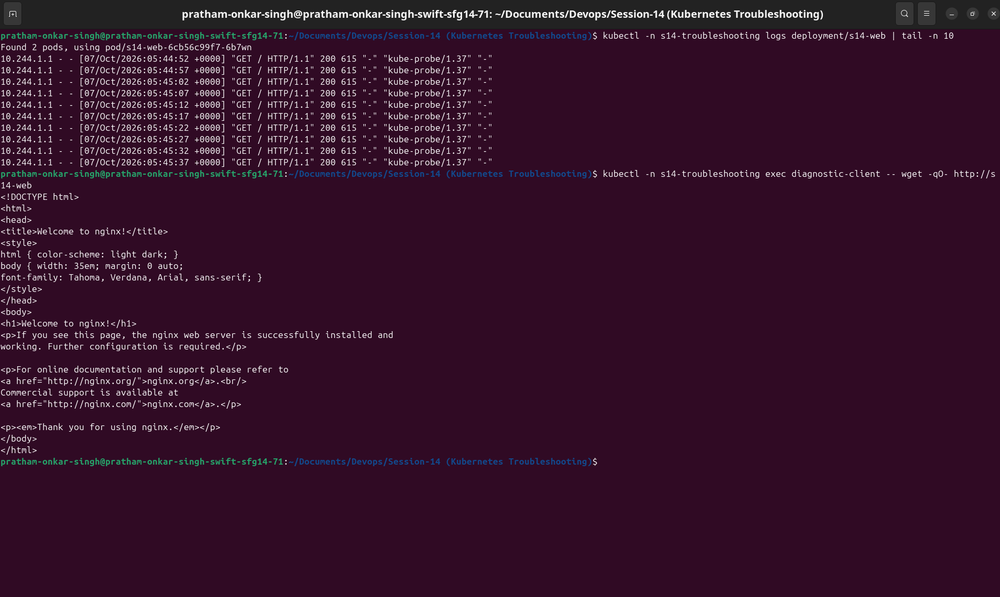
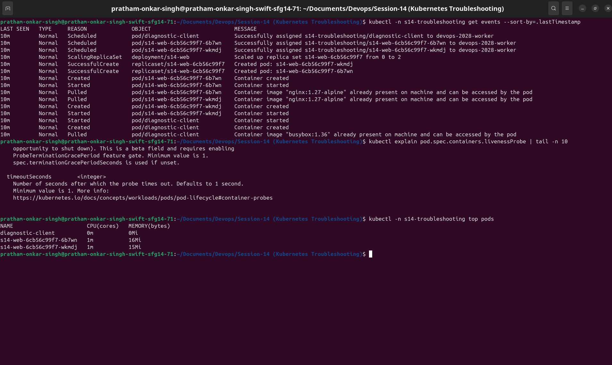
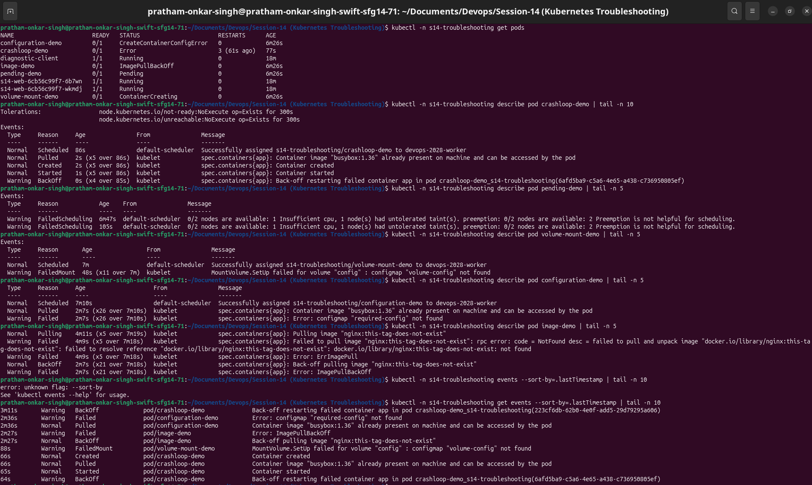
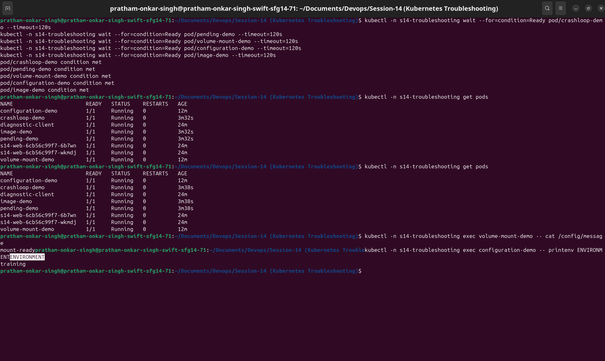
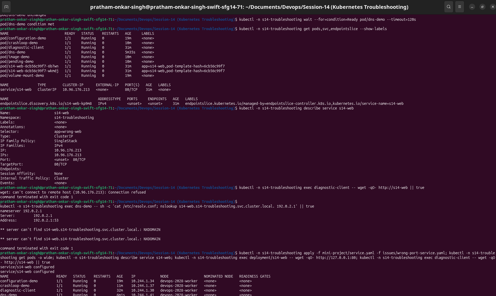
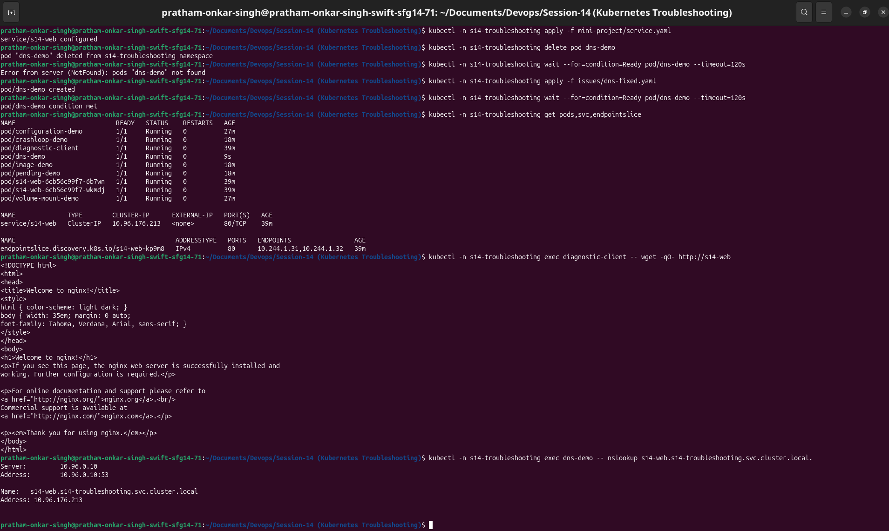

# Session 14: Kubernetes Troubleshooting

This repository documents hands-on Kubernetes troubleshooting in the isolated `s14-troubleshooting` namespace. Each fault was reproduced with a deliberately broken manifest, investigated with `kubectl`, corrected, and verified.

## Deliverables

| Requirement | Evidence |
|---|---|
| Troubleshooting commands | Command reference and terminal captures below |
| Common Kubernetes issues | Broken and fixed resources in `issues/` |
| Mini project | Nginx Deployment, ClusterIP Service, and diagnostic client in `mini-project/` |
| Investigation and resolution | Problem, root cause, solution, and verification for each issue |
| Before/after results | Workload and connectivity evidence captures |
| Screenshots | Seven embedded terminal captures in `images/` |

## Environment and setup

The lab used a Kubernetes cluster with CoreDNS. Metrics Server was available for `kubectl top`.

```bash
kubectl create namespace s14-troubleshooting
kubectl -n s14-troubleshooting apply -f mini-project/app.yaml -f mini-project/service.yaml -f issues/client.yaml
kubectl -n s14-troubleshooting rollout status deployment/s14-web
kubectl -n s14-troubleshooting wait --for=condition=Ready pod/diagnostic-client --timeout=120s
```

## Task 1: Kubernetes troubleshooting commands

The healthy Nginx application and diagnostic client were used to practise the required commands.

| Command | Purpose |
|---|---|
| `kubectl get` | Checked resource status, readiness, restarts, and names. |
| `kubectl get -o wide` | Identified Pod IPs and node placement. |
| `kubectl describe` | Examined configuration, conditions, and resource events. |
| `kubectl logs` | Read container output; `--previous` targeted the last crashed container. |
| `kubectl exec` | Tested HTTP connectivity and configuration from inside a Pod. |
| `kubectl events` | Displayed scheduling, pull, mount, and startup events. |
| `kubectl explain` | Inspected the API documentation for a probe field. |
| `kubectl top` | Checked live Pod CPU and memory use. |

```bash
kubectl -n s14-troubleshooting get all
kubectl -n s14-troubleshooting get pods -o wide
kubectl -n s14-troubleshooting describe deployment s14-web
kubectl -n s14-troubleshooting logs deployment/s14-web
kubectl -n s14-troubleshooting exec diagnostic-client -- wget -qO- http://s14-web
kubectl -n s14-troubleshooting events --sort-by=.lastTimestamp
kubectl explain pod.spec.containers.livenessProbe
kubectl -n s14-troubleshooting top pods
```

### Resource inspection

`get`, `get -o wide`, and `describe` confirmed the healthy resources, their IP and node assignment, and Deployment configuration.



### Logs and in-container connectivity

The Deployment logs and request issued from `diagnostic-client` confirmed that the Service routed traffic to Nginx.



### Events, API help, and metrics

Events, `kubectl explain`, and resource metrics completed the command practice.



## Task 2: Common Kubernetes issues

Each issue followed the same approach: identify the symptom, investigate the resource and events, determine the root cause, apply the correction, and verify the healthy state.

### CrashLoopBackOff

| Stage | Result |
|---|---|
| Problem | `crashloop-demo` repeatedly exited and entered `CrashLoopBackOff`. |
| Investigation | `describe` showed repeated restarts and `logs --previous` targeted the failed instance. |
| Root cause | The container command printed `starting` and exited with status `1`. |
| Solution | The broken command was replaced with a long-running `sleep 3600` command. |
| Verification | The replacement Pod reached `1/1 Running` without increasing restart count. |

```bash
kubectl -n s14-troubleshooting apply -f issues/crashloop-broken.yaml
kubectl -n s14-troubleshooting describe pod crashloop-demo
kubectl -n s14-troubleshooting logs crashloop-demo --previous
kubectl -n s14-troubleshooting delete pod crashloop-demo
kubectl -n s14-troubleshooting apply -f issues/crashloop-fixed.yaml
kubectl -n s14-troubleshooting wait --for=condition=Ready pod/crashloop-demo --timeout=120s
```

### Pending

| Stage | Result |
|---|---|
| Problem | `pending-demo` remained in `Pending`. |
| Investigation | Scheduling events reported `Insufficient cpu`. |
| Root cause | The Pod requested `1000` CPU cores, which could not fit on any node. |
| Solution | The CPU request was reduced to `10m`. |
| Verification | The corrected Pod was scheduled and became Ready. |

```bash
kubectl -n s14-troubleshooting apply -f issues/pending-broken.yaml
kubectl -n s14-troubleshooting describe pod pending-demo
kubectl -n s14-troubleshooting delete pod pending-demo
kubectl -n s14-troubleshooting apply -f issues/pending-fixed.yaml
kubectl -n s14-troubleshooting wait --for=condition=Ready pod/pending-demo --timeout=120s
```

### ContainerCreating

| Stage | Result |
|---|---|
| Problem | `volume-mount-demo` was scheduled but remained in `ContainerCreating`. |
| Investigation | `describe` reported `FailedMount` for ConfigMap `volume-config`. |
| Root cause | The ConfigMap referenced by the volume did not exist. |
| Solution | `volume-config` was created. |
| Verification | The Pod became Ready and `/config/message` returned `mount-ready`. |

```bash
kubectl -n s14-troubleshooting apply -f issues/containercreating-broken.yaml
kubectl -n s14-troubleshooting describe pod volume-mount-demo
kubectl -n s14-troubleshooting apply -f issues/volume-config.yaml
kubectl -n s14-troubleshooting exec volume-mount-demo -- cat /config/message
```

### Configuration issue

| Stage | Result |
|---|---|
| Problem | `configuration-demo` reported `CreateContainerConfigError`. |
| Investigation | `describe` identified a missing ConfigMap used by `envFrom`. |
| Root cause | `required-config` had not been created. |
| Solution | The ConfigMap was created with `ENVIRONMENT=training`. |
| Verification | The Pod became Ready and `printenv ENVIRONMENT` returned `training`. |

```bash
kubectl -n s14-troubleshooting apply -f issues/configuration-broken.yaml
kubectl -n s14-troubleshooting describe pod configuration-demo
kubectl -n s14-troubleshooting apply -f issues/required-config.yaml
kubectl -n s14-troubleshooting exec configuration-demo -- printenv ENVIRONMENT
```

### ErrImagePull and ImagePullBackOff

| Stage | Result |
|---|---|
| Problem | `image-demo` could not start because its image could not be pulled. |
| Investigation | Pod events showed `ErrImagePull`, followed by `ImagePullBackOff`. |
| Root cause | The Nginx tag `this-tag-does-not-exist` was invalid. |
| Solution | The image was changed to `nginx:1.27-alpine`. |
| Verification | The corrected Pod reached `Running`. |

```bash
kubectl -n s14-troubleshooting apply -f issues/image-broken.yaml
kubectl -n s14-troubleshooting describe pod image-demo
kubectl -n s14-troubleshooting events --for pod/image-demo
kubectl -n s14-troubleshooting delete pod image-demo
kubectl -n s14-troubleshooting apply -f issues/image-fixed.yaml
kubectl -n s14-troubleshooting wait --for=condition=Ready pod/image-demo --timeout=120s
```

### Workload issue evidence

The before capture shows the five broken workload states and their diagnostic events. The after capture confirms that all corrected Pods became Ready; the ConfigMap volume and environment variable were also read from their running containers.





### Service connectivity

| Stage | Result |
|---|---|
| Problem | The diagnostic client could not access `s14-web`. |
| Investigation | The Service had no EndpointSlice addresses, and Pod labels did not match its selector. |
| Root cause | The broken Service used `app: wrong-web`; application Pods use `app: s14-web`. |
| Solution | The Service selector was restored to `app: s14-web`. |
| Verification | Endpoints appeared and the client received the Nginx page. |

```bash
kubectl -n s14-troubleshooting get pods --show-labels
kubectl -n s14-troubleshooting get endpointslice -l kubernetes.io/service-name=s14-web
kubectl -n s14-troubleshooting describe service s14-web
kubectl -n s14-troubleshooting exec diagnostic-client -- wget -qO- http://s14-web
```

### DNS issue

| Stage | Result |
|---|---|
| Problem | The Service name did not resolve from `dns-demo`. |
| Investigation | `/etc/resolv.conf` showed the invalid nameserver `192.0.2.1`. |
| Root cause | `dnsPolicy: None` replaced the Kubernetes DNS configuration. |
| Solution | The Pod was recreated with `dnsPolicy: ClusterFirst`. |
| Verification | The fully-qualified Service name resolved and the HTTP request succeeded. |

```bash
kubectl -n s14-troubleshooting exec dns-demo -- cat /etc/resolv.conf
kubectl -n s14-troubleshooting exec dns-demo -- nslookup s14-web.s14-troubleshooting.svc.cluster.local.
kubectl -n s14-troubleshooting exec dns-demo -- wget -qO- http://s14-web
```

### Pod networking / wrong target port

| Stage | Result |
|---|---|
| Problem | DNS resolved and endpoints existed, but HTTP traffic was refused. |
| Investigation | Nginx responded on port `80` inside its Pod, while the Service used `targetPort: 8081`. |
| Root cause | The Service target port did not match the Nginx listening port. |
| Solution | `targetPort` was corrected to `80`. |
| Verification | The diagnostic client reached `http://s14-web` successfully. |

```bash
kubectl -n s14-troubleshooting get pods -o wide
kubectl -n s14-troubleshooting describe service s14-web
kubectl -n s14-troubleshooting exec deployment/s14-web -- wget -qO- http://127.0.0.1:80
kubectl -n s14-troubleshooting exec diagnostic-client -- wget -qO- http://s14-web
```

### Connectivity evidence

The before capture records the empty Service endpoints, incorrect DNS resolver, and wrong target-port failure. The after capture verifies Service endpoints, DNS resolution, and a successful HTTP response from the diagnostic client.





## Task 3: Mini project

The mini project is a two-replica Nginx application exposed through a ClusterIP Service. Its healthy baseline supported the Service, DNS, and port troubleshooting exercises.

```text
diagnostic-client --> s14-web Service:80 --> s14-web Deployment (nginx:80)
                         ^
                    EndpointSlice selected by app=s14-web
```

The application manifests and project summary are available in [mini-project/README.md](mini-project/README.md).

## Cleanup

```bash
kubectl delete namespace s14-troubleshooting
```
