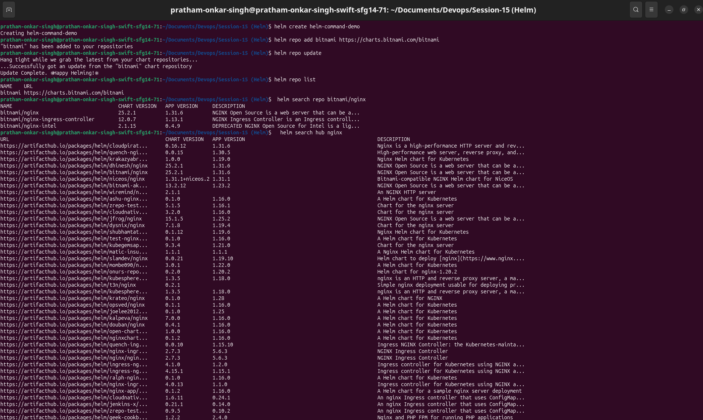
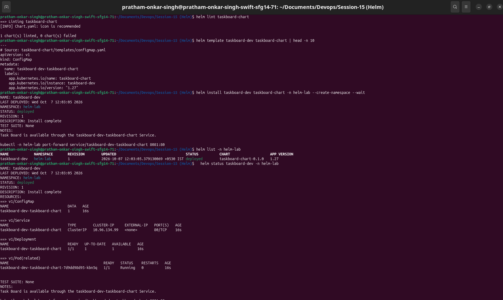
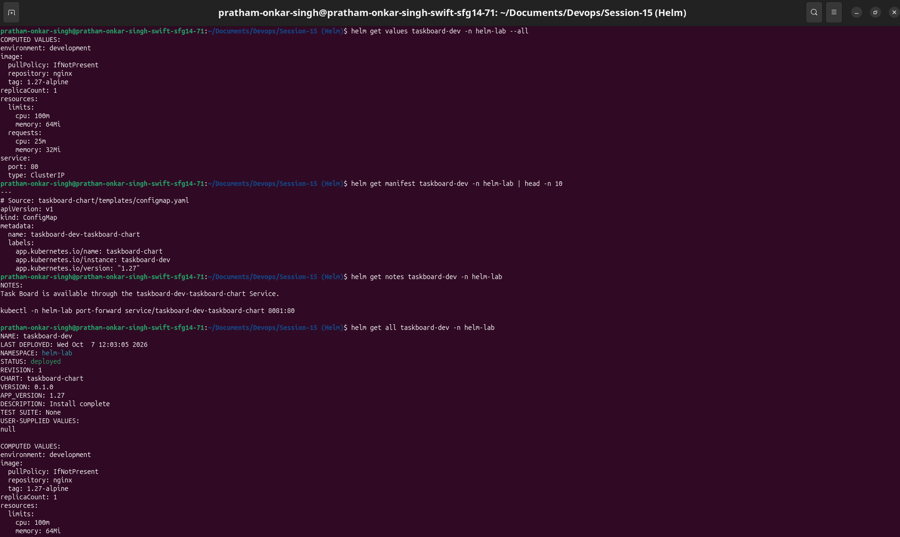
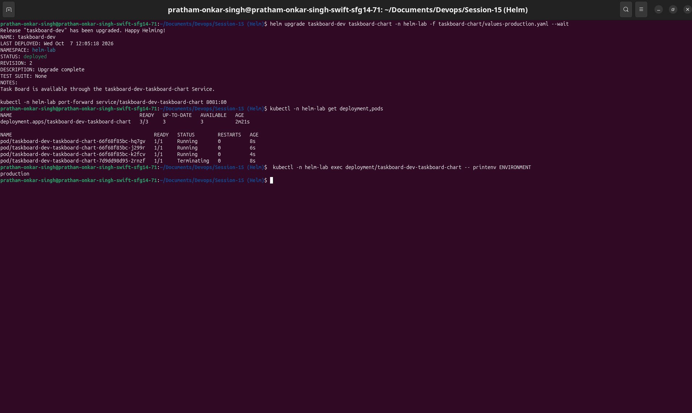
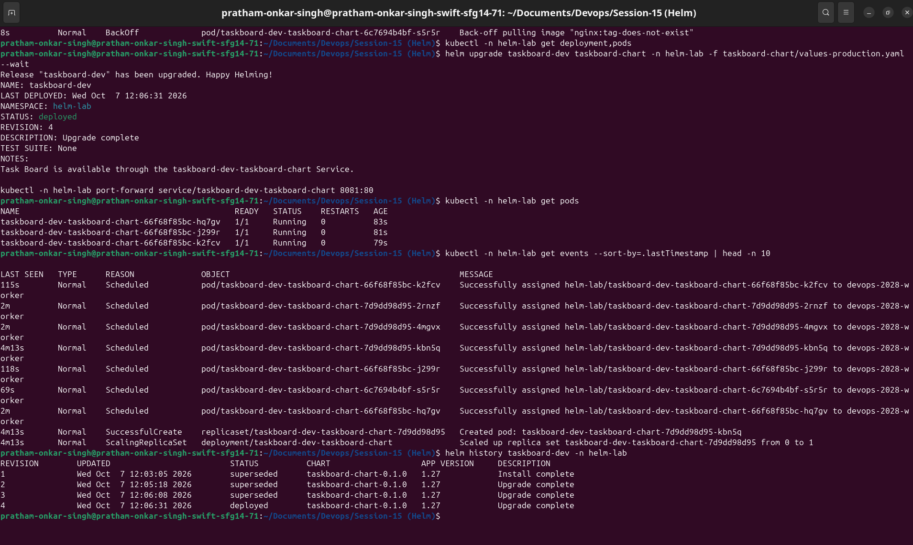
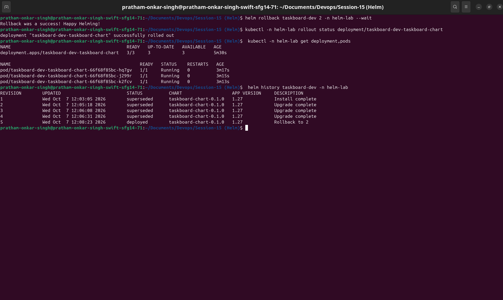
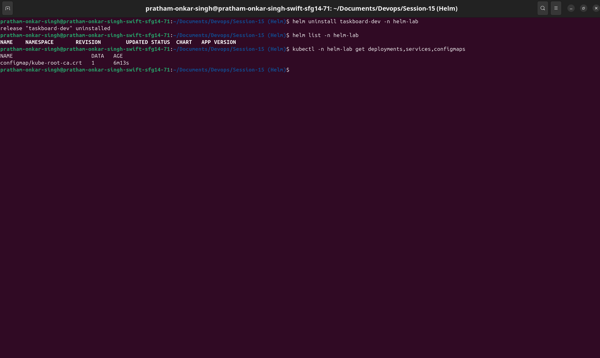

# Session 15: Helm

This submission documents Helm command practice, a complete release rollback workflow, and a custom Task Board mini-project. The chart packages an Nginx application, ConfigMap, and ClusterIP Service into one versioned release.

## Deliverables

| Requirement | Included |
|---|---|
| Helm command practice | Command reference, purpose, and evidence sections |
| Helm chart | `taskboard-chart/` with chart metadata, values, helpers, and templates |
| Installation, upgrades, and rollback | Versioned release workflow in `helm-lab` |
| Mini project | Two-replica Task Board web application and Service |
| Screenshots | Evidence locations embedded below |

## Chart structure

```text
taskboard-chart/
├── Chart.yaml
├── values.yaml
├── values-production.yaml
└── templates/
    ├── _helpers.tpl
    ├── configmap.yaml
    ├── deployment.yaml
    ├── service.yaml
    └── NOTES.txt
```

`values.yaml` defines a one-replica development release. `values-production.yaml` changes the page environment to `production` and scales the Deployment to three replicas. The templates use release-aware names and labels, so one chart can be installed under different release names.

## Task 1: Helm commands

| Command | Purpose |
|---|---|
| `helm create helm-command-demo` | Generated Helm's starter chart structure for inspection. |
| `helm repo add bitnami https://charts.bitnami.com/bitnami` | Added a public chart repository. |
| `helm repo update` / `helm repo list` | Refreshed and listed local repository indexes. |
| `helm search repo bitnami/nginx` | Searched the configured chart repository. |
| `helm search hub nginx` | Searched public Helm charts through Artifact Hub. |
| `helm install` | Created the `taskboard-dev` release. |
| `helm list` / `helm status` | Listed the release and showed its current state. |
| `helm get values`, `manifest`, `notes`, `all` | Inspected the installed release data. |
| `helm upgrade` | Created production and intentionally broken revisions. |
| `helm history` | Displayed the revision timeline. |
| `helm rollback` | Restored the healthy production revision. |
| `helm uninstall` | Removed the release after the exercise. |

```bash
helm create helm-command-demo
helm repo add bitnami https://charts.bitnami.com/bitnami
helm repo update
helm repo list
helm search repo bitnami/nginx
helm search hub nginx
helm lint taskboard-chart
helm template taskboard-dev taskboard-chart
helm install taskboard-dev taskboard-chart -n helm-lab --create-namespace --wait
helm list -n helm-lab
helm status taskboard-dev -n helm-lab
helm get values taskboard-dev -n helm-lab --all
helm get manifest taskboard-dev -n helm-lab
helm get notes taskboard-dev -n helm-lab
helm get all taskboard-dev -n helm-lab
```

### Command evidence

The first capture records chart creation and repository searches. The second records chart validation, rendering, installation, listing, and status. The third records release inspection with `helm get`.







## Task 2: Helm rollback workflow

The release history followed the required lifecycle.

```text
Install (revision 1)
       ↓
Upgrade to production (revision 2)
       ↓
Verify three replicas and production page
       ↓
Upgrade to invalid image (revision 3)
       ↓
Verify ImagePullBackOff
       ↓
Rollback to revision 2 (revision 4)
       ↓
Verify healthy production release
```

```bash
# Revision 1: development
helm install taskboard-dev taskboard-chart -n helm-lab --create-namespace --wait

# Revision 2: production configuration
helm upgrade taskboard-dev taskboard-chart -n helm-lab -f taskboard-chart/values-production.yaml --wait
kubectl -n helm-lab get deployment,pods
kubectl -n helm-lab exec deployment/taskboard-dev-taskboard-chart -- printenv ENVIRONMENT

# Revision 3: intentionally invalid image; no --wait preserves the failed workload for investigation
helm upgrade taskboard-dev taskboard-chart -n helm-lab -f taskboard-chart/values-production.yaml --set image.tag=tag-does-not-exist
kubectl -n helm-lab get pods
kubectl -n helm-lab get events --sort-by=.lastTimestamp
helm history taskboard-dev -n helm-lab

# Revision 4: restore revision 2
helm rollback taskboard-dev 2 -n helm-lab --wait
kubectl -n helm-lab rollout status deployment/taskboard-dev-taskboard-chart
kubectl -n helm-lab get deployment,pods
helm history taskboard-dev -n helm-lab
```

| Revision | Change | Result |
|---|---|---|
| 1 | Installed development values | One healthy replica; `ENVIRONMENT=development`. |
| 2 | Applied production values | Three healthy replicas; `ENVIRONMENT=production`. |
| 3 | Set an invalid Nginx image tag | New Pod reported `ErrImagePull` / `ImagePullBackOff`. |
| 4 | Rolled back to revision 2 | Production configuration and healthy replicas were restored. |

The failed revision remains in `helm history`; rollback creates a new revision instead of deleting history.







## Task 3: Mini project

The Task Board mini-project serves a simple environment-aware web page through a Kubernetes Service.

```text
Client --> taskboard-dev-taskboard-chart Service:80 --> Task Board Pods:80
                                                        └── ConfigMap-mounted index.html
```

The release is verified from a local port-forward:

```bash
kubectl -n helm-lab port-forward service/taskboard-dev-taskboard-chart 8081:80
curl -fsS http://127.0.0.1:8081
```

The chart configuration and rendered resources are described in [taskboard-chart/README.md](taskboard-chart/README.md).

## Cleanup

```bash
helm uninstall taskboard-dev -n helm-lab
helm list -n helm-lab
kubectl delete namespace helm-lab
```

The release was uninstalled after verification.


