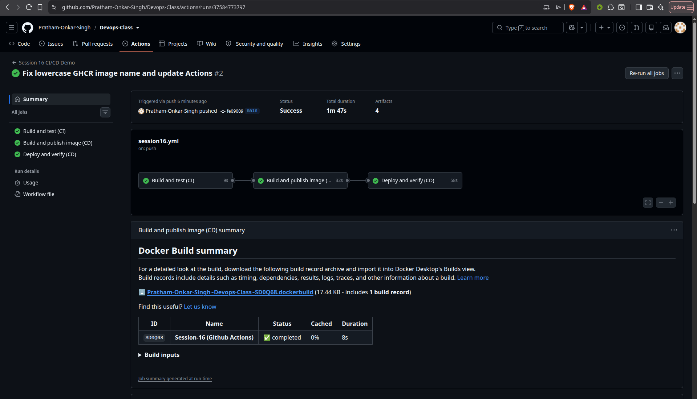

# Session 16: CI/CD and GitHub Actions

This demo project implements a complete CI/CD pipeline for a small Flask calculator service. Every push or pull request runs the CI checks; a push to `main` or `master` continues through image publishing and a Kubernetes deployment verification.

## Deliverables

| Requirement | Evidence |
|---|---|
| Application source | `app.py` with health, readiness, metadata, and calculator endpoints |
| Tests | `tests/test_app.py` and JUnit test-report artifact |
| Dockerfile | `Dockerfile` using a slim Python runtime and non-root user |
| GitHub Actions workflow | [`.github/workflows/session16.yml`](../.github/workflows/session16.yml) |
| CI pipeline | Compile, install, unit test, and test-report artifact |
| CD pipeline | Build/publish GHCR image, deploy to Kind, and verify HTTP responses |
| Secrets and artifacts | `GITHUB_TOKEN`, registry pull secret, and three uploaded artifact groups |
| Successful execution evidence | `images/s16-actions-run.png` |

## Application

The Flask application exposes:

| Endpoint | Purpose |
|---|---|
| `GET /` | Returns application name, version, and environment. |
| `GET /health` | Liveness check. |
| `GET /ready` | Readiness check used by the deployment verification. |
| `POST /api/calculate` | Performs add, subtract, multiply, and divide operations. |

Example request:

```bash
curl -fsS -X POST http://127.0.0.1:5000/api/calculate \
  -H 'Content-Type: application/json' \
  -d '{"a":6,"b":3,"operation":"multiply"}'
```

The response is `{"a":6.0,"b":3.0,"operation":"multiply","result":18.0}`. Invalid operations, missing fields, and division by zero return HTTP 400.

## Run locally

```bash
python3 -m venv .venv
source .venv/bin/activate
pip install -r requirements-dev.txt
pytest -v
gunicorn --bind 127.0.0.1:5000 --workers 1 app:app
```

## Docker image

The Dockerfile installs only runtime dependencies, copies the application, exposes port 5000, and runs Gunicorn as the `nobody` user.

```bash
docker build -t session-16-ci-cd:local .
docker run --rm -p 5000:5000 session-16-ci-cd:local
```

## CI versus CD

Continuous Integration (CI) validates every change early by compiling the source, installing dependencies, running unit tests, and uploading the JUnit report. Continuous Delivery/Deployment (CD) takes the tested commit, builds an immutable Docker image tagged with the commit SHA, publishes it to GHCR, deploys that exact image to a temporary Kind cluster, and verifies health and business behavior.

## GitHub Actions concepts demonstrated

| Concept | Implementation |
|---|---|
| Workflow | `.github/workflows/session16.yml` defines triggers, permissions, jobs, and steps. |
| Jobs | `ci`, `publish`, and `deploy`; `needs` creates the CI → CD dependency. |
| Steps | Checkout, Python setup, install, compile, test, Docker build/push, Kind deployment, and verification. |
| Runner | GitHub-hosted `ubuntu-latest` executes each job. |
| Secret | GitHub's automatic `GITHUB_TOKEN` authenticates to GHCR and creates the temporary pull secret; it is never hardcoded. |
| Artifact | JUnit report, application files, deployment JSON response, and port-forward log are uploaded for download. |
| Build | `docker/build-push-action` builds the image from this directory and tags it with `${{ github.sha }}`. |
| Test | Pytest covers health/readiness, successful calculation, and invalid input. |
| Pipeline execution | A push to a protected branch runs all three jobs; pull requests run CI without publishing. |

## Pipeline flow

```text
push / pull request
        │
        ▼
CI: checkout → Python setup → install → compile → pytest → test artifact
        │
        ├── pull request: stop after CI
        │
        ▼
CD publish: GHCR login → build image → push SHA/latest tags → source artifact
        │
        ▼
CD deploy: Kind cluster → pull secret → deployment → rollout → health/calculator checks
        │
        ▼
deployment evidence artifact
```

The publish and deploy jobs run only after CI succeeds. The deployment job uses the image tagged with the same commit SHA that was built by the publish job, so the verified workload is the tested source revision.

## Workflow execution

The successful Actions run completed all three jobs: CI tests passed, the image was published, the temporary Kind cluster reached readiness, and the calculator returned `18`. The run also produced the configured test, application, and deployment artifacts.



## GitHub configuration

The workflow needs no manually created registry password. GitHub supplies `GITHUB_TOKEN`; the workflow grants `packages: write` to the publish job and `packages: read` to the deploy job. Repository Actions settings must allow the token to read/write packages when publishing to GHCR.

## Cleanup

The Kind cluster is temporary and the workflow removes it when the deploy job finishes. Local Docker and Python resources can be removed with the normal project cleanup commands.
