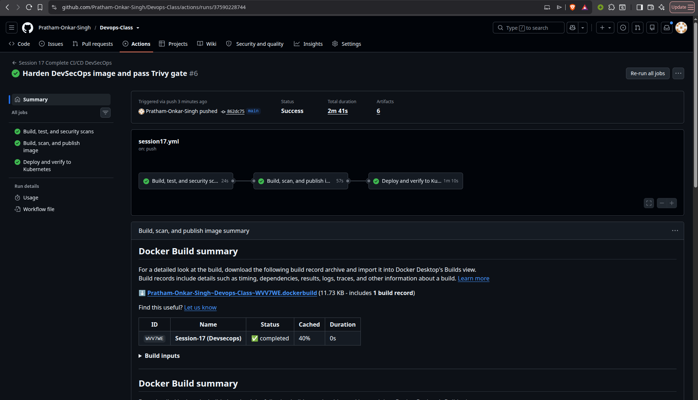
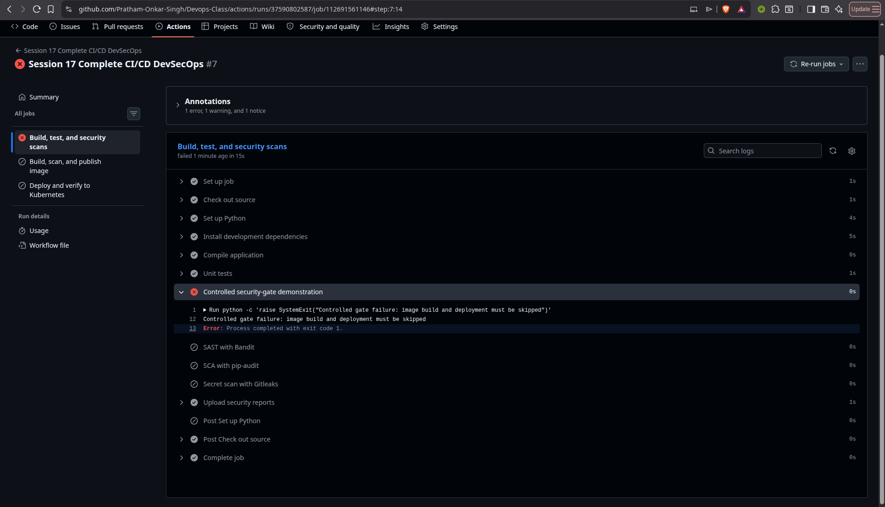

# Session 17: Complete CI/CD and DevSecOps

This project extends the Session 16 application with security checks at every relevant stage. The workflow blocks image publication and Kubernetes deployment when a required security gate fails.

## Deliverables

| Requirement | Included |
|---|---|
| Application | `app.py`, Flask health/readiness endpoints, and calculator API |
| Dockerfile | Hardened Alpine-based runtime running as `nobody` |
| Unit testing | `tests/test_app.py` and JUnit report |
| SAST | Bandit configuration and JSON report |
| SCA | pip-audit dependency scan and JSON report |
| Secret scanning | Gitleaks scan with repository-safe allowlist |
| Container image scanning | Trivy scan of the built image |
| Security gates | Failed scans stop later jobs; Trivy blocks fixable HIGH/CRITICAL findings |
| Container registry | GHCR image tagged with the commit SHA and `latest` |
| Kubernetes deployment | Kind cluster, pull secret, Deployment, Service, probes, and API verification |
| Screenshots | Successful pipeline and security-gate evidence in `images/` |

## Expected pipeline flow

```text
Code
 ↓
Build and unit test
 ↓
SAST: Bandit
 ↓
SCA: pip-audit
 ↓
Secret scan: Gitleaks
 ↓
Docker build
 ↓
Container image scan: Trivy
 ↓
Security gate
 ↓
Push approved image to GHCR
 ↓
Deploy the same commit image to Kubernetes
 ↓
Verify readiness, health, and calculator behavior
```

## Application

The Flask application provides:

| Endpoint | Purpose |
|---|---|
| `GET /` | Returns application, version, and environment metadata. |
| `GET /health` | Liveness response. |
| `GET /ready` | Readiness response used by Kubernetes and the deploy job. |
| `POST /api/calculate` | Supports add, subtract, multiply, and divide. |

The successful deployment verification posts `6 × 3` and asserts that the returned result is `18`.

## Local checks

```bash
python3 -m venv .venv
source .venv/bin/activate
pip install -r requirements-dev.txt
pytest -v
bandit -c security/bandit.yaml -q app.py
pip-audit -r requirements.txt
```

The local checks use the same tools as the CI workflow. Gitleaks and Trivy run in the workflow so the exact scanner versions and container image are consistent on the runner.

## Security controls and gates

| Control | Tool | Gate behavior |
|---|---|---|
| SAST | Bandit | Any Bandit failure fails the security job. |
| SCA | pip-audit | A vulnerable dependency or audit error fails the security job. |
| Secret scanning | Gitleaks | A detected secret fails the security job. |
| Image scanning | Trivy | Fixable HIGH or CRITICAL vulnerabilities fail the image job. Unfixed findings remain visible in the report. |
| Job dependency | GitHub Actions `needs` | Image build waits for all source/security checks; deployment waits for the approved image. |

There is no `continue-on-error` on the security checks. The `gate_demo` workflow-dispatch input provides a controlled CI failure for demonstrating that the image and deploy jobs are skipped.

## GitHub Actions concepts

| Concept | Implementation |
|---|---|
| Workflow | [`.github/workflows/session17.yml`](../.github/workflows/session17.yml) |
| Jobs | `security`, `image`, and `deploy`, chained with `needs` |
| Steps | Checkout, Python setup, build, test, scans, Docker build, push, Kubernetes deployment, and verification |
| Runner | GitHub-hosted `ubuntu-latest` |
| Secrets | Automatic `GITHUB_TOKEN` authenticates to GHCR and creates the Kubernetes pull secret; no token is hardcoded |
| Artifacts | Security reports, application source, image scan report, deployment JSON, and port-forward log |
| Security gate | Trivy returns exit code 1 on configured fixable HIGH/CRITICAL findings |

## Kubernetes deployment

The manifests in [`kubernetes/`](kubernetes/) define a two-replica Deployment and ClusterIP Service. The workflow substitutes the exact approved SHA-tagged image into `deployment.yaml`, creates the GHCR pull secret, waits for rollout, and checks the API through a port-forward. Readiness and liveness probes protect the deployment from receiving traffic before the application is ready.

## Pipeline evidence

The successful run evidence shows the security job passing all scans, the image job passing the Trivy gate and publishing to GHCR, and the deploy job verifying Kubernetes and the calculator response.



The gate evidence shows a controlled failing CI gate with downstream image publishing and deployment skipped. The real Trivy gate is enforced separately with `exit-code: 1` for fixable HIGH/CRITICAL findings.



## Cleanup

The workflow deletes its temporary Kind cluster with an `always()` cleanup step. Local Docker images and Python virtual environments can be removed using the normal project cleanup commands.
