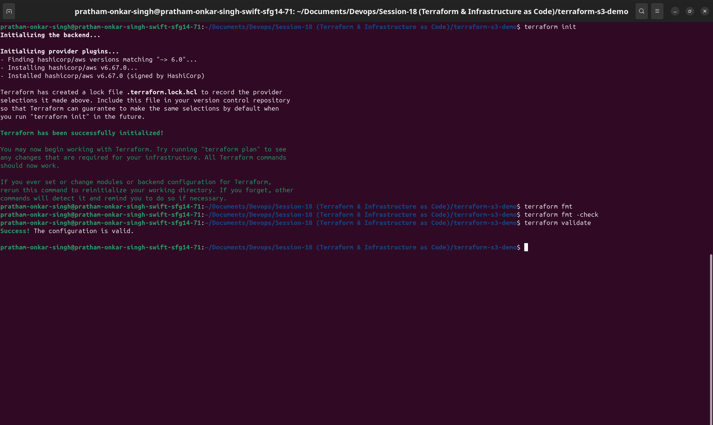
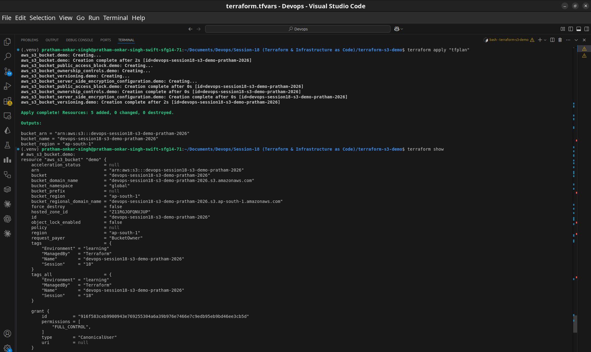
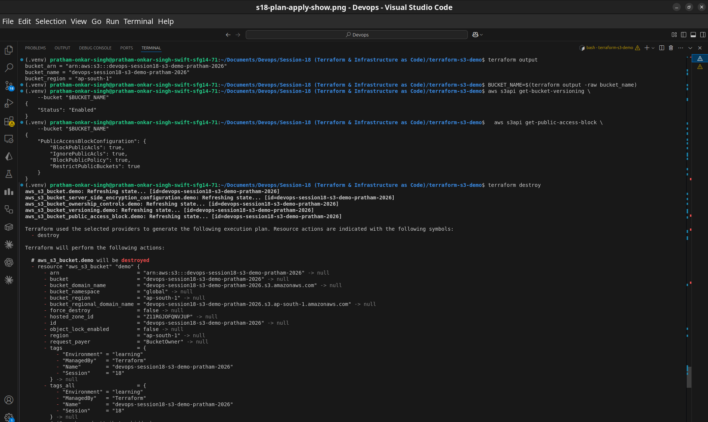

# Terraform S3 Demo

This project provisions and removes a secure AWS S3 bucket using Terraform. It demonstrates the standard Infrastructure as Code workflow: initialize, format, validate, plan, apply, inspect, output, verify, and destroy.

## Result

The Terraform configuration creates one bucket with:

- Versioning enabled
- AES-256 server-side encryption
- `BucketOwnerEnforced` object ownership (ACLs disabled)
- All four S3 public-access blocks enabled
- `force_destroy = false`

## Project files

| File | Purpose |
|---|---|
| `provider.tf` | Terraform and AWS provider requirements plus region configuration |
| `variables.tf` | Region, globally unique bucket name, and environment variables |
| `terraform.tfvars` | Example values for this submission |
| `main.tf` | S3 bucket and security-related resources |
| `outputs.tf` | Bucket name, ARN, and region outputs |
| `.terraform.lock.hcl` | Provider dependency lock file generated by `terraform init` |

## Prerequisites

Terraform 1.6 or newer and AWS CLI credentials are required. Configure credentials through an AWS profile, environment variables, or an IAM role; no access key is stored in this repository.

```bash
aws sts get-caller-identity
terraform version
```

The AWS CLI profile used for the hands-on run was `session18`:

```bash
export AWS_PROFILE=session18
```

The bucket name is globally unique in AWS. Update `terraform.tfvars` if the example name is already taken.

## Complete Terraform workflow

### Initialize

```bash
terraform init
```

Terraform downloaded the locked AWS provider and prepared the working directory.

### Format and validate

```bash
terraform fmt
terraform fmt -check
terraform validate
```

`fmt -check` confirmed canonical formatting. `validate` confirmed that the configuration and resource references were structurally valid.

### Plan

```bash
terraform plan -out=tfplan
```

The plan showed one S3 bucket plus ownership controls, public-access blocking, versioning, and encryption resources to be created. Saving `tfplan` makes the reviewed plan the exact input to apply; the binary file is intentionally ignored by Git.

### Apply

```bash
terraform apply tfplan
```

Terraform created the bucket after AWS credentials and the globally unique name were available. The apply output reported the resource IDs and completed outputs.

### Inspect state and outputs

```bash
terraform show
terraform output
terraform output bucket_name
aws s3api get-bucket-versioning --bucket "$(terraform output -raw bucket_name)"
aws s3api get-public-access-block --bucket "$(terraform output -raw bucket_name)"
```

`terraform show` displayed the state-managed resources. `terraform output` printed the bucket name, ARN, and region. The AWS CLI checks verified versioning and public-access protection.

### Destroy

```bash
terraform destroy
```

The bucket has `force_destroy = false`, so it must be empty before destruction. Terraform displayed a confirmation prompt and then removed the managed resources. This step prevents an unused learning bucket from incurring storage or request charges.

## Verification and cleanup

The AWS API checks confirm the important security settings independently of Terraform state. The final `terraform destroy` removed the learning resources after verification, preventing unnecessary AWS charges.

## Security decisions

- Bucket ownership is enforced, so ACLs are disabled.
- All public access paths are blocked.
- Versioning protects against accidental object overwrites and deletions.
- AES-256 server-side encryption is enabled by default.
- `force_destroy` is disabled to prevent accidental deletion of objects.
- Credentials are supplied externally and never committed.

## Evidence

The terminal captures document the completed command sequence.



*Initialization, formatting, and validation completed successfully.*



*The reviewed plan was applied and the resulting state was inspected.*



*Terraform outputs and AWS API checks were followed by successful cleanup.*
