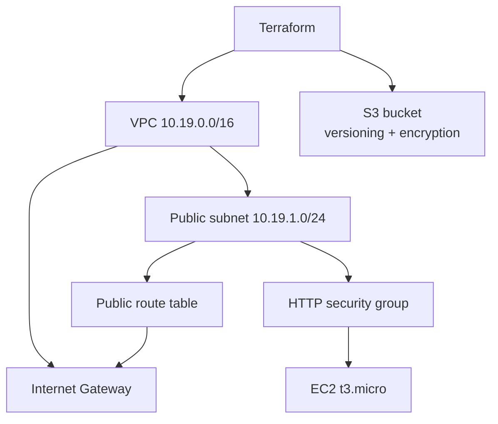
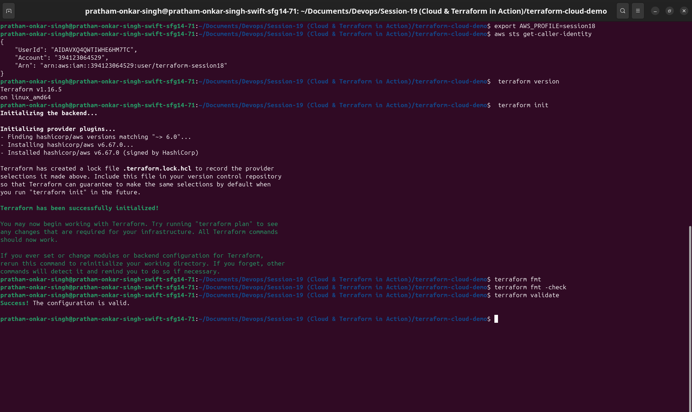
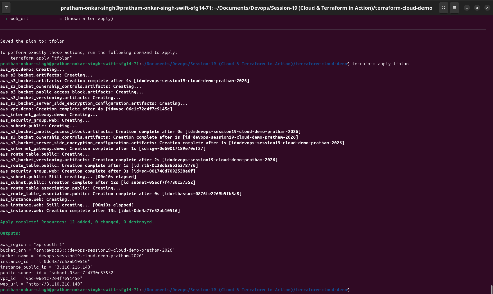
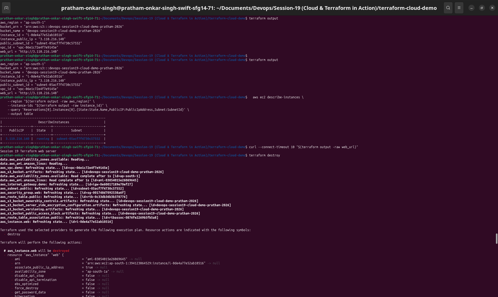
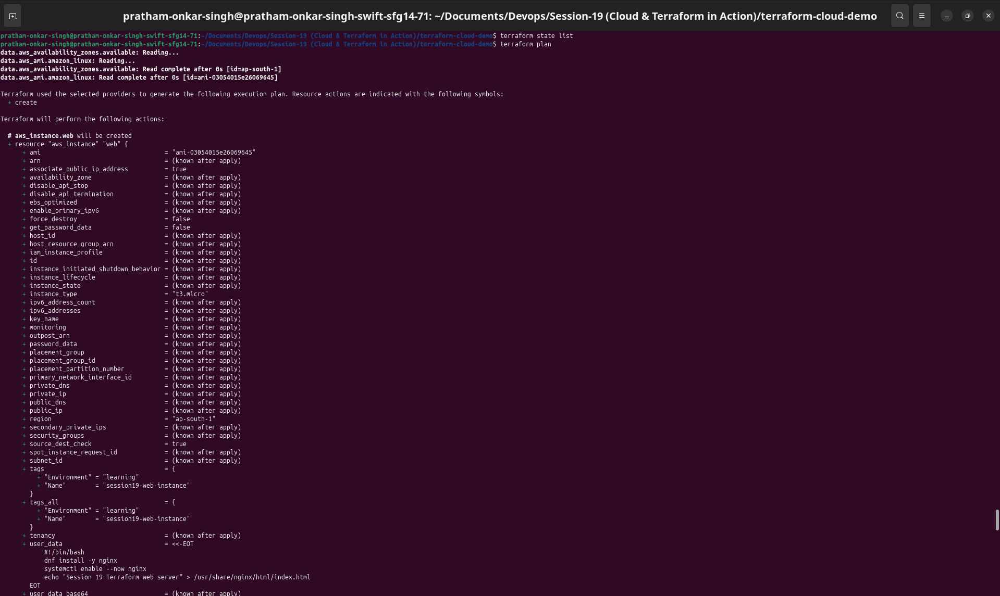

# Session 19: Cloud & Terraform in Action

This session is an end-to-end AWS infrastructure project built with Terraform. The configuration demonstrates providers, variables, resources, outputs, dependencies, Terraform state, and the complete `plan` → `apply` → `destroy` lifecycle.

## Project

Open the [Terraform cloud demo](terraform-cloud-demo/) for the implementation and execution evidence.

The project provisions:

- A VPC with a `10.19.0.0/16` CIDR
- A public subnet with automatic public IPv4 addresses
- An Internet Gateway and public route table
- A security group allowing HTTP traffic
- An Amazon Linux EC2 `t3.micro` instance
- A versioned, encrypted S3 bucket

## Architecture

## Deliverables

| Deliverable | Location |
|---|---|
| Terraform project | [terraform-cloud-demo/](terraform-cloud-demo/) |
| Architecture diagram | This README and project README |
| Terraform command evidence | [terraform-cloud-demo/README.md](terraform-cloud-demo/README.md) |
| Screenshots | [terraform-cloud-demo/images/](terraform-cloud-demo/images/) |

The EC2 instance and S3 bucket are learning resources. Run `terraform destroy` after collecting evidence to avoid ongoing AWS usage.

## Execution evidence

