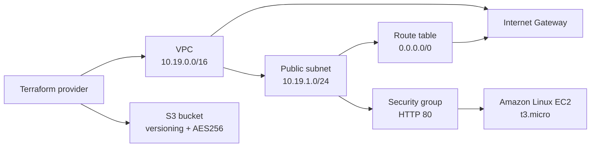

# Terraform Cloud Infrastructure Demo

This project provisions a small AWS environment with Terraform and demonstrates the relationship between providers, variables, resources, outputs, dependencies, and state.

## Architecture



## Resources created

| Resource | Purpose |
|---|---|
| `aws_vpc.demo` | Isolated `10.19.0.0/16` network |
| `aws_subnet.public` | Public subnet in the first available AZ |
| `aws_internet_gateway.demo` | Internet routing for the VPC |
| `aws_route_table.public` | Default route through the Internet Gateway |
| `aws_security_group.web` | Allows HTTP and outbound traffic |
| `aws_instance.web` | Amazon Linux `t3.micro` demo server running Nginx |
| `aws_s3_bucket.artifacts` | Versioned and encrypted object storage |

Terraform infers most dependencies from references such as `aws_vpc.demo.id`. The EC2 resource also uses an explicit `depends_on` so the public route is established before the instance starts its web-server bootstrap.

## Files

| File | Purpose |
|---|---|
| `provider.tf` | Terraform and AWS provider configuration |
| `variables.tf` | Reusable inputs and validation |
| `terraform.tfvars` | Values used for this learning deployment |
| `main.tf` | VPC, subnet, routing, security, EC2, and S3 resources |
| `outputs.tf` | IDs, IP address, URL, and bucket details |
| `images/` | Execution screenshots |

## Prerequisites

Terraform 1.8+, AWS CLI v2, and an AWS profile with permission to create the listed resources are required. The profile used in the hands-on run is `session18`.

```bash
export AWS_PROFILE=session18
aws sts get-caller-identity
terraform version
```

The S3 bucket name is globally unique. Change `bucket_name` in `terraform.tfvars` if AWS reports that the name is already in use.

## Terraform workflow

### 1. Initialize and validate

```bash
terraform init
terraform fmt
terraform fmt -check
terraform validate
```

`init` downloads the AWS provider and creates the dependency lock file. `fmt` applies canonical HCL formatting, and `validate` checks the configuration structure.

### 2. Review the plan

```bash
terraform plan -out=tfplan
```

The plan should show the VPC, subnet, route table, Internet Gateway, security group, EC2 instance, S3 bucket, and supporting S3 security resources. The saved plan is intentionally ignored by Git.

### 3. Apply the infrastructure

```bash
terraform apply tfplan
```

Terraform records resource IDs and relationships in the local state file. The outputs include the VPC ID, subnet ID, instance ID, public IP, web URL, and S3 bucket name.

### 4. Verify resources and outputs

```bash
terraform show
terraform output

aws ec2 describe-instances \
  --region "$(terraform output -raw aws_region)" \
  --instance-ids "$(terraform output -raw instance_id)" \
  --query 'Reservations[0].Instances[0].{State:State.Name,PublicIP:PublicIpAddress,Subnet:SubnetId}' \
  --output table

curl --connect-timeout 10 "$(terraform output -raw web_url)"
```

The EC2 API response verifies the instance state and public IP. The HTTP response verifies that Nginx completed its user-data bootstrap. `terraform show` demonstrates the state-managed infrastructure.

### 5. Destroy the learning environment

The S3 bucket must be empty because `force_destroy = false`. It is empty in this demo, so destroy can be run directly:

```bash
terraform destroy
```

Enter `yes` at the confirmation prompt. Confirm cleanup with:

```bash
terraform state list
terraform plan
```

The state list should be empty and the final plan should report no resources to add, change, or destroy. Destroying the environment is important because EC2, public IPv4 addresses, and other AWS resources can incur charges.

## Evidence

The following screenshots are the required evidence for this assignment:


