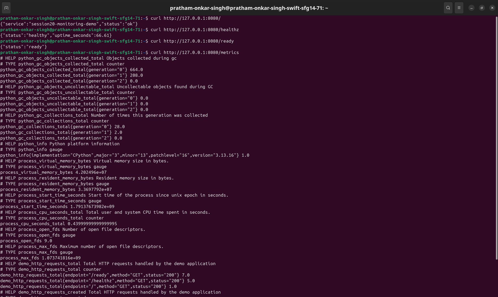
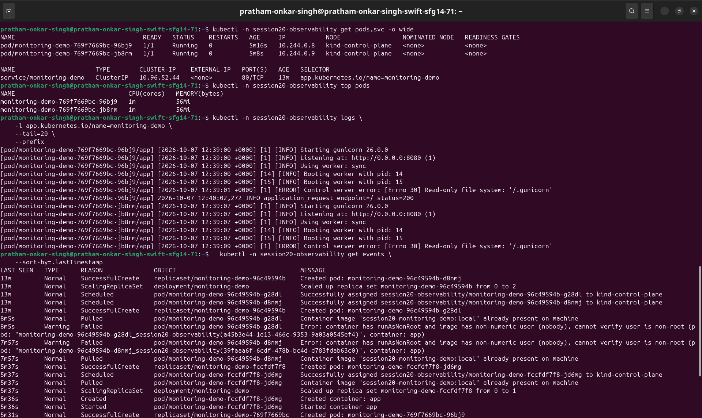
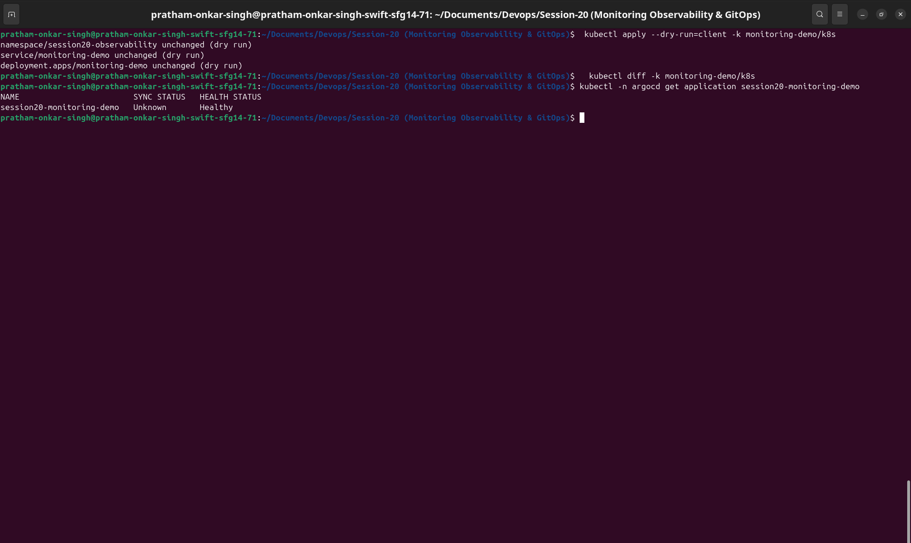

# Monitoring Demo

This demo packages a small Flask application and deploys it to Kubernetes with health probes, resource governance, Prometheus metrics, and alert rules.

## Application endpoints

| Endpoint | Purpose |
|---|---|
| `/` | Application response and structured request log |
| `/healthz` | Liveness and application health |
| `/ready` | Readiness for receiving traffic |
| `/metrics` | Prometheus-format counters and gauges |

## Local application test

```bash
cd monitoring-demo/app
python3 -m venv .venv
.venv/bin/pip install -r requirements.txt
.venv/bin/python app.py
```

In another terminal:

```bash
curl http://127.0.0.1:8080/healthz
curl http://127.0.0.1:8080/ready
curl http://127.0.0.1:8080/metrics
```

## Kubernetes deployment

Build the image and load it into a local cluster such as Kind:

```bash
docker build -t session20-monitoring-demo:local monitoring-demo/app
kind load docker-image session20-monitoring-demo:local
kubectl apply -k monitoring-demo/k8s
kubectl -n session20-observability rollout status deployment/monitoring-demo
```

The Kubernetes manifests request `100m` CPU and `128Mi` memory per pod, limit each pod to `500m` CPU and `256Mi`, and expose liveness/readiness probes. Prometheus Operator installations can consume the `ServiceMonitor` and `PrometheusRule` resources.

If Prometheus Operator is installed, apply the optional monitoring resources:

```bash
kubectl apply -k monitoring-demo/monitoring
```

## Monitoring commands

```bash
kubectl -n session20-observability get pods,svc
kubectl -n session20-observability top pods
kubectl -n session20-observability logs -l app.kubernetes.io/name=monitoring-demo --tail=20 --prefix
kubectl -n session20-observability get events --sort-by=.lastTimestamp
kubectl -n session20-observability port-forward svc/monitoring-demo 8080:80
```

With the port-forward active:

```bash
curl http://127.0.0.1:8080/healthz
curl http://127.0.0.1:8080/ready
curl http://127.0.0.1:8080/metrics
```

## GitOps validation

```bash
kubectl apply --dry-run=client -k monitoring-demo/k8s
kubectl diff -k monitoring-demo/k8s
kubectl explain deployment.spec.template.spec.containers.resources
```

The Argo CD Application in `../gitops/argocd-application.yaml` watches this Kubernetes path after the repository is pushed. Apply it only when Argo CD is installed:

```bash
kubectl apply -f ../gitops/argocd-application.yaml
kubectl -n argocd get application session20-monitoring-demo
```

## Cleanup

```bash
kubectl delete -k monitoring-demo/k8s
```

If the optional Prometheus Operator resources were applied, remove them too:

```bash
kubectl delete -k monitoring-demo/monitoring
```

## Required evidence






