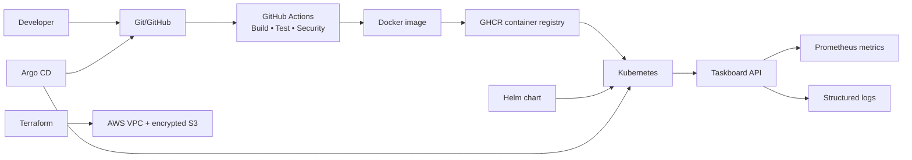
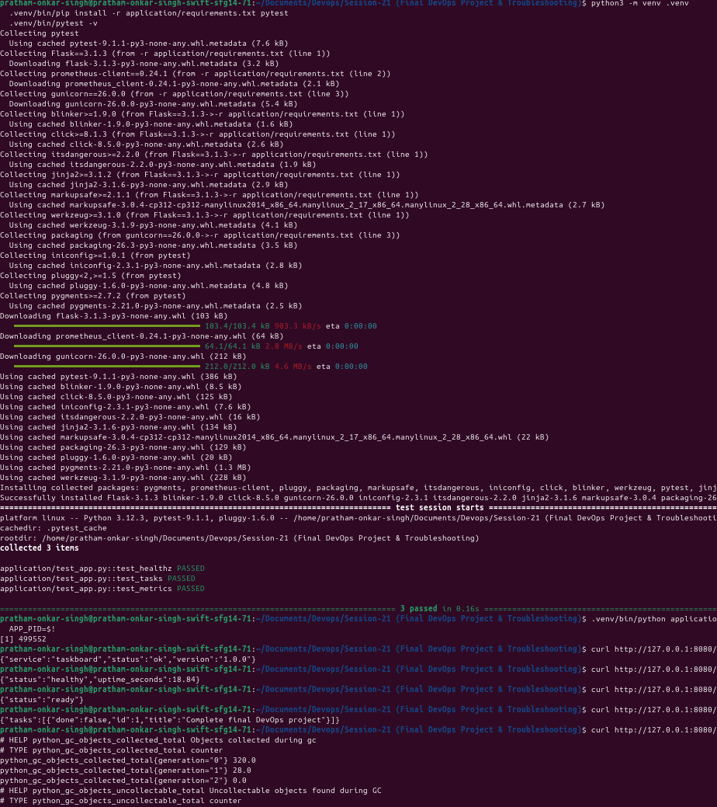
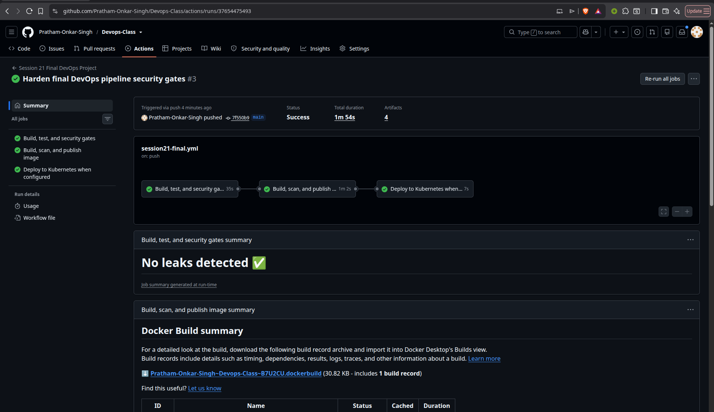

# Final DevOps Project & Troubleshooting

This project brings together the course workflow into one reproducible Taskboard application:

```text
Code → Git/GitHub → CI → Test/Security → Docker → Registry
     → Kubernetes → Helm → Monitoring → GitOps
```

The project is designed for local Kubernetes practice, with Terraform cloud infrastructure kept separate from the application deployment. The default Kubernetes image is local/registry-ready, and the GitHub Actions workflow publishes only when registry credentials are available.

## Project overview

The Taskboard API is a small Flask service with health probes, Prometheus metrics, structured logs, and configuration supplied through Kubernetes ConfigMap/Secret objects. It can be deployed with raw Kubernetes manifests or the Helm chart.

## Architecture



## Repository structure

```text
final-devops-project/
├── application/              # Flask API and unit tests
├── docker/                   # Production container image
├── kubernetes/               # Deployment, Service, ConfigMap, Secret, Ingress, HPA, PVC
├── helm/                     # Reusable Helm chart
├── terraform/                # AWS VPC and S3 infrastructure
├── .github/workflows/        # CI/CD and DevSecOps pipeline
├── security/                 # Bandit, Gitleaks, and Trivy configuration
├── monitoring/               # Prometheus rules, ServiceMonitor, dashboard
├── gitops/                   # Argo CD Application
├── troubleshooting/          # Intentionally broken examples and root-cause records
└── README.md
```

## Technologies used

Python, Flask, pytest, Docker, GitHub Actions, Bandit, pip-audit, Gitleaks, Trivy, Kubernetes, Helm, Prometheus, Grafana, Argo CD, Terraform, and AWS.

## Quick start

```bash
cd application
python3 -m venv .venv
.venv/bin/pip install -r requirements.txt
.venv/bin/pytest -q
.venv/bin/python app.py
```

The API listens on port `8080`. Test it with:

```bash
curl http://127.0.0.1:8080/healthz
curl http://127.0.0.1:8080/metrics
```

## Deployment choices

- [Application and Docker](application/README.md)
- [Kubernetes deployment](kubernetes/README.md)
- [Helm deployment](helm/README.md)
- [Terraform infrastructure](terraform/README.md)
- [Monitoring](monitoring/README.md)
- [GitOps](gitops/README.md)
- [Troubleshooting challenge](troubleshooting/README.md)

## CI/CD and DevSecOps

The workflow in `.github/workflows/final-pipeline.yml` runs tests, SAST, SCA, secret scanning, Docker build, Trivy image scanning, and a security gate before publishing to GHCR. A Kubernetes deployment step runs only when a `KUBE_CONFIG` secret is configured.

## Screenshots

The required evidence is embedded below after execution:






## Lessons learned

- Keep application configuration outside the image.
- Treat security scans as release gates, not post-deployment checks.
- Use resource requests, probes, and HPA signals together.
- Use Helm for repeatable packaging and GitOps for continuous reconciliation.
- Troubleshoot from symptoms through events, logs, configuration, and verification.
