# Final DevOps Project & Troubleshooting

This project combines the complete DevOps lifecycle into one Taskboard application. A code change travels from Git and GitHub through automated testing, security gates, container publishing, Kubernetes deployment, Helm packaging, monitoring, and GitOps reconciliation.

## Project objective

The project demonstrates:

- Application development and unit testing
- Git-based source control and GitHub collaboration
- Docker image creation and container registry publishing
- Kubernetes orchestration and configuration management
- Helm packaging and release history
- Terraform infrastructure as code
- SAST, SCA, secret scanning, and container image scanning
- Prometheus metrics, structured logs, and health probes
- Argo CD GitOps delivery
- Systematic troubleshooting from symptom to verified fix

## End-to-end flow

```text
Application
    ↓
Git and GitHub
    ↓
GitHub Actions: build → test → security gates
    ↓
Docker image → GHCR container registry
    ↓
Kubernetes deployment / Helm release
    ↓
Prometheus metrics and application logs
    ↓
Argo CD continuous reconciliation
```

## Architecture

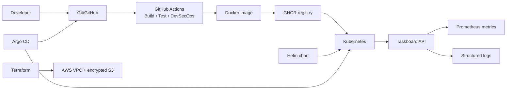

## Technology stack

| Area | Tools |
|---|---|
| Application | Python, Flask, Gunicorn, pytest |
| Source control | Git, GitHub |
| CI/CD | GitHub Actions, GHCR |
| Security | Bandit, pip-audit, Gitleaks, Trivy |
| Containers | Docker |
| Orchestration | Kubernetes, Kind |
| Packaging | Helm |
| Infrastructure | Terraform, AWS VPC, Amazon S3 |
| Monitoring | Prometheus, Grafana, Kubernetes logs/events |
| GitOps | Argo CD |

## Repository structure

```text
final-devops-project/
├── application/              # Flask API, dependencies, and unit tests
├── docker/                   # Production Dockerfile and image definition
├── kubernetes/               # Deployment, Service, ConfigMap, Secret, Ingress, HPA, PVC
├── helm/                     # Reusable Taskboard Helm chart
├── terraform/                # AWS VPC, routing, and encrypted S3 infrastructure
├── .github/workflows/        # Standalone CI/CD and DevSecOps workflow
├── security/                 # Bandit, Gitleaks, and Trivy configuration
├── monitoring/               # ServiceMonitor, alert rules, and Grafana dashboard
├── gitops/                   # Argo CD Application definition
├── troubleshooting/          # Broken examples and root-cause records
├── images/                   # Execution evidence
└── README.md
```

## 1. Application

The Taskboard API is intentionally small so the platform behavior is easy to observe. It returns service metadata, a sample task list, health responses, and Prometheus-format metrics. Configuration is read from environment variables so the same image can run in development, CI, and Kubernetes.

| Endpoint | Purpose |
|---|---|
| `/` | Service metadata and version |
| `/healthz` | Liveness health check |
| `/ready` | Readiness check |
| `/api/tasks` | Example Taskboard payload |
| `/metrics` | Prometheus counters and gauges |

Run and test it locally:

```bash
cd application
python3 -m venv .venv
.venv/bin/pip install -r requirements.txt pytest
.venv/bin/pytest -v
.venv/bin/python app.py
```

The application listens on port `8080`. The complete application documentation is in [application/README.md](application/README.md).


## 2. Docker and container registry

The Dockerfile uses a small Python Alpine base image, installs pinned dependencies, removes packaging tools, runs as numeric non-root UID `65534`, and exposes port `8080`. The image is built locally for Kind and is tagged with the Git commit SHA in GitHub Actions before being pushed to GHCR.

```bash
docker build -t final-devops-taskboard:local -f docker/Dockerfile .
docker run --rm -p 8080:8080 final-devops-taskboard:local
```

The build context is the Session 21 project directory, so the root `.dockerignore` excludes virtual environments, Terraform state, plans, and screenshots.

## 3. Kubernetes deployment

The Kubernetes manifests define the complete runtime contract:

- Deployment with two replicas
- ClusterIP Service
- ConfigMap for non-sensitive settings
- Secret placeholder for sensitive configuration
- Nginx Ingress for `taskboard.local`
- CPU-based HPA from two to five replicas
- Liveness and readiness probes
- PersistentVolumeClaim for application data
- Resource requests and limits

Deploy to Kind:

```bash
docker build -t final-devops-taskboard:local -f docker/Dockerfile .
kind load docker-image final-devops-taskboard:local
kubectl apply -k kubernetes/
kubectl -n final-devops rollout status deployment/taskboard
kubectl -n final-devops get pods,svc,ingress,hpa,pvc
```

See [kubernetes/README.md](kubernetes/README.md) for deployment and cleanup details.

## 4. Helm packaging

The Helm chart packages the same application as configurable templates. `values.yaml` controls the image, replica count, resources, ingress, HPA, persistence, ConfigMap, and Secret. Helm provides release history and rollback capabilities.

```bash
helm lint helm/taskboard
helm template taskboard helm/taskboard
helm upgrade --install taskboard helm/taskboard \
  --namespace final-devops \
  --create-namespace \
  --set image.repository=final-devops-taskboard \
  --set image.tag=local
helm status taskboard -n final-devops
```

The complete Helm workflow is documented in [helm/taskboard/README.md](helm/taskboard/README.md).

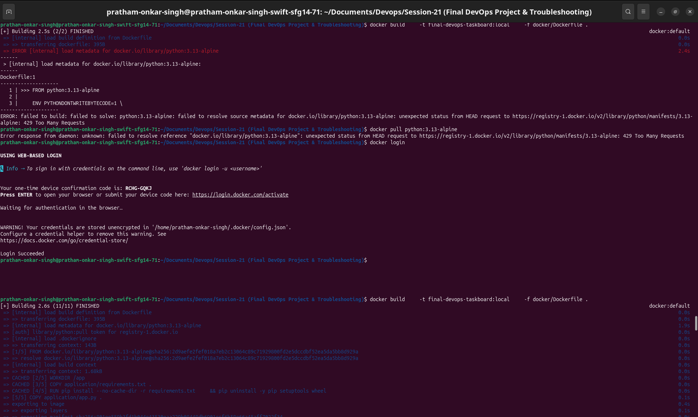

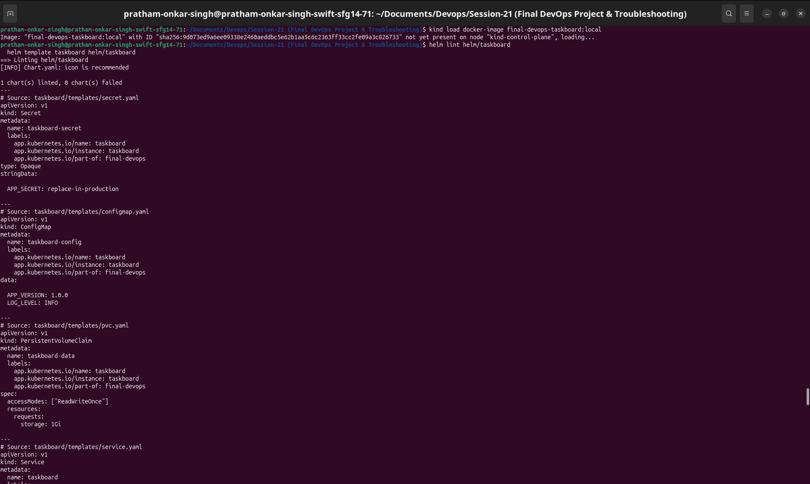

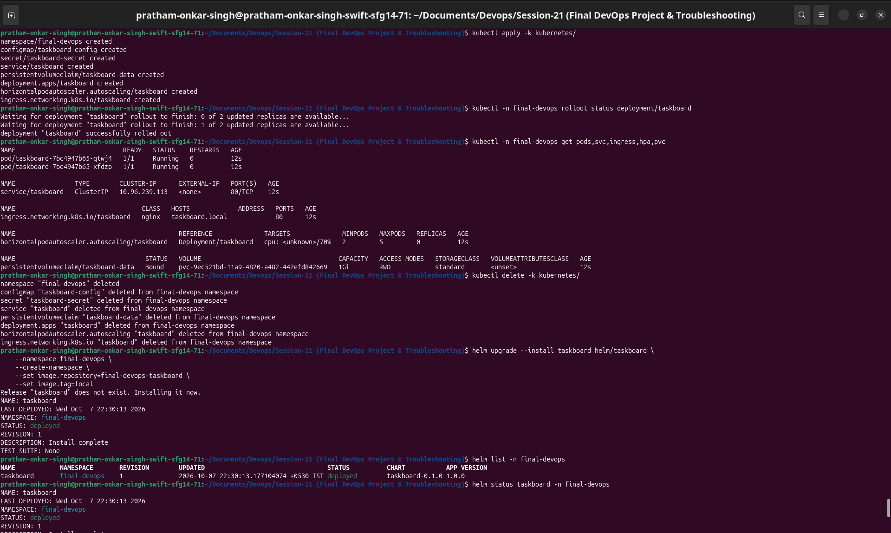

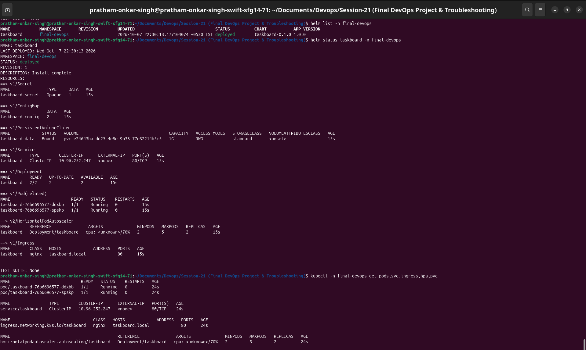

## 5. Terraform infrastructure

Terraform provisions the cloud foundation independently from the local Kubernetes workload:

- AWS VPC with DNS support
- Public subnet
- Internet Gateway
- Public route table and association
- Versioned, AES-256 encrypted S3 artifact bucket
- S3 public-access blocking and bucket-owner-enforced ownership

Workflow:

```bash
cd terraform
export AWS_PROFILE=session18
terraform init
terraform fmt
terraform validate
terraform plan -out=tfplan
terraform apply tfplan
terraform show
terraform output
terraform destroy
```

The bucket must be empty before destruction. Full details are in [terraform/README.md](terraform/README.md).

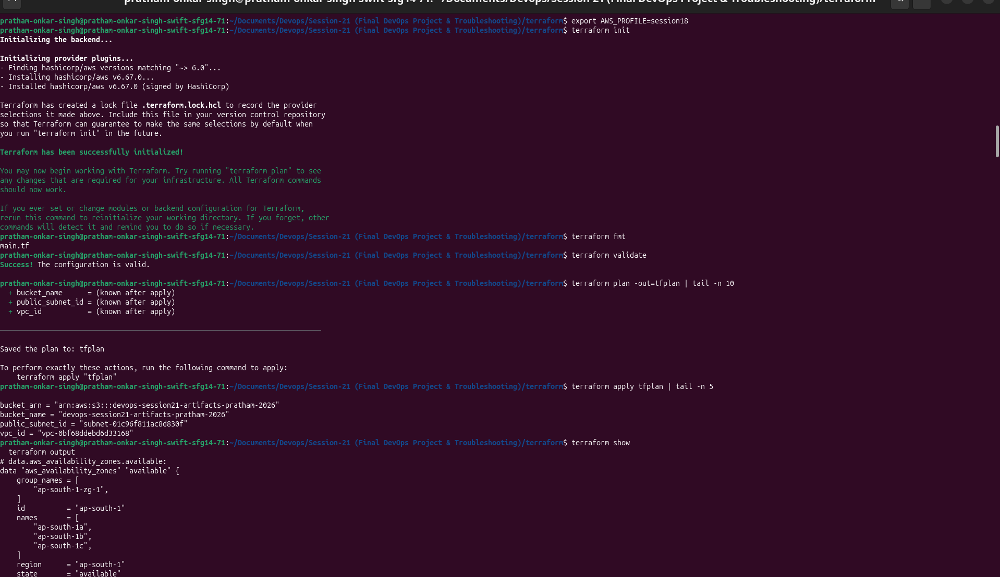

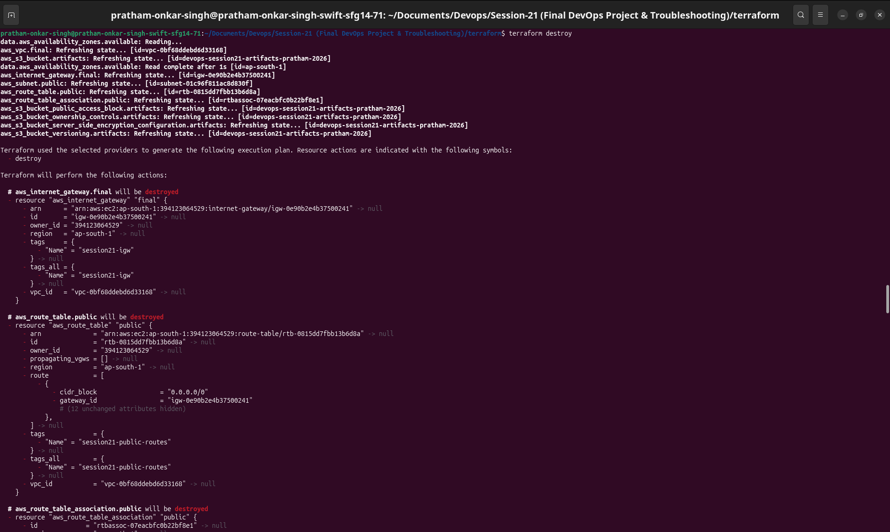

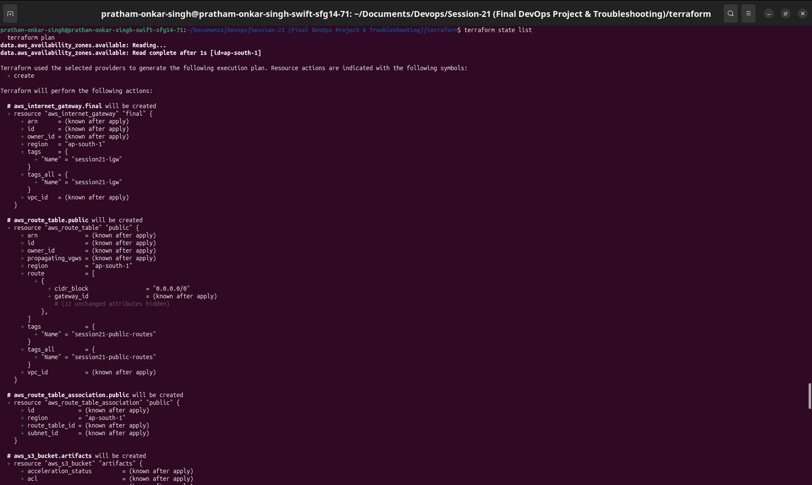

## 6. CI/CD pipeline

The GitHub Actions pipeline is triggered by changes to the Session 21 project and has three stages:

1. **CI and security:** install dependencies, run unit tests, Bandit SAST, pip-audit SCA, and Gitleaks.
2. **Image release:** build the image, scan it with Trivy, and push only a clean image to GHCR.
3. **Deployment:** apply Kubernetes manifests when the optional `KUBE_CONFIG` repository secret is configured; otherwise the deployment stage exits successfully with an explicit skip message.

Security checks are gates: a failed test, vulnerability, secret, or HIGH/CRITICAL image finding prevents publishing.

The monorepo workflow is [../.github/workflows/session21-final.yml](../.github/workflows/session21-final.yml) when viewed from this project, and the standalone workflow is [.github/workflows/final-pipeline.yml](.github/workflows/final-pipeline.yml).


## 7. DevSecOps implementation

| Gate | Tool | Evidence |
|---|---|---|
| SAST | Bandit | Python security checks; intentional container bind is skipped as `B104` |
| SCA | pip-audit | Dependency vulnerability report |
| Secret scanning | Gitleaks | Repository credential detection |
| Container scanning | Trivy | HIGH/CRITICAL image gate with unfixed findings ignored |
| Release policy | GitHub Actions dependencies | Image push depends on all security stages |

Configuration is stored in [security/](security/). No real credentials are committed; the Kubernetes Secret contains a demo placeholder only.

## 8. Monitoring and observability

The application emits three useful classes of telemetry:

- **Metrics:** request counters and the last successful health-check timestamp at `/metrics`.
- **Logs:** structured request logs available through `kubectl logs`.
- **Health signals:** Kubernetes probes and deployment replica state.

Prometheus Operator users can apply the `ServiceMonitor` and `PrometheusRule`. The Grafana dashboard JSON contains request-rate and available-replica panels.

```bash
kubectl -n final-devops port-forward svc/taskboard 8080:80
curl http://127.0.0.1:8080/metrics
kubectl -n final-devops logs -l app.kubernetes.io/name=taskboard --tail=30 --prefix
kubectl -n final-devops get events --sort-by=.lastTimestamp
```

See [monitoring/README.md](monitoring/README.md).

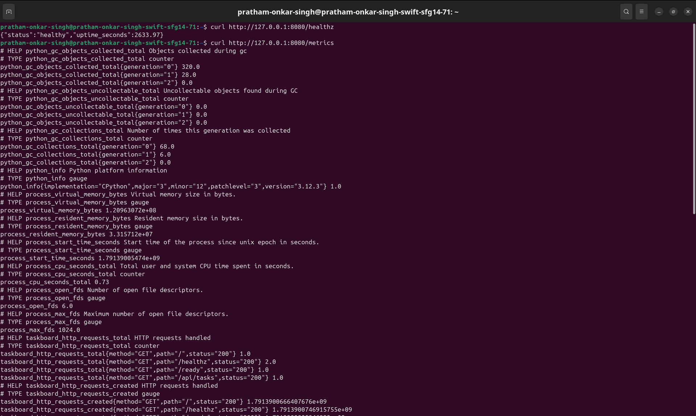

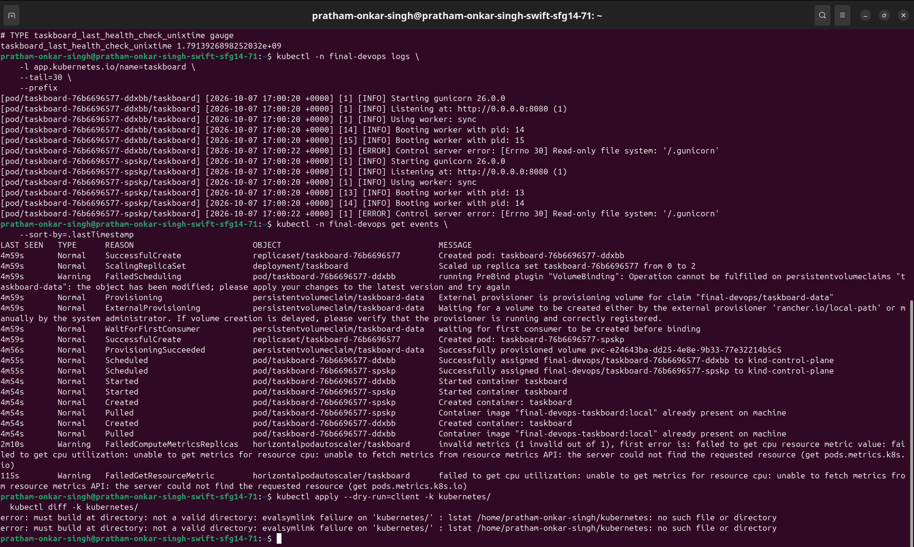

## 9. GitOps workflow

GitOps treats the Kubernetes directory in Git as the desired state. Argo CD watches the repository, applies new revisions, reports `Synced`/`Healthy` status, prunes deleted resources, and self-heals manual drift.

```bash
kubectl apply -f gitops/argocd-application.yaml
kubectl -n argocd get application final-devops-taskboard
kubectl -n argocd describe application final-devops-taskboard
```

The complete GitOps workflow is in [gitops/README.md](gitops/README.md).

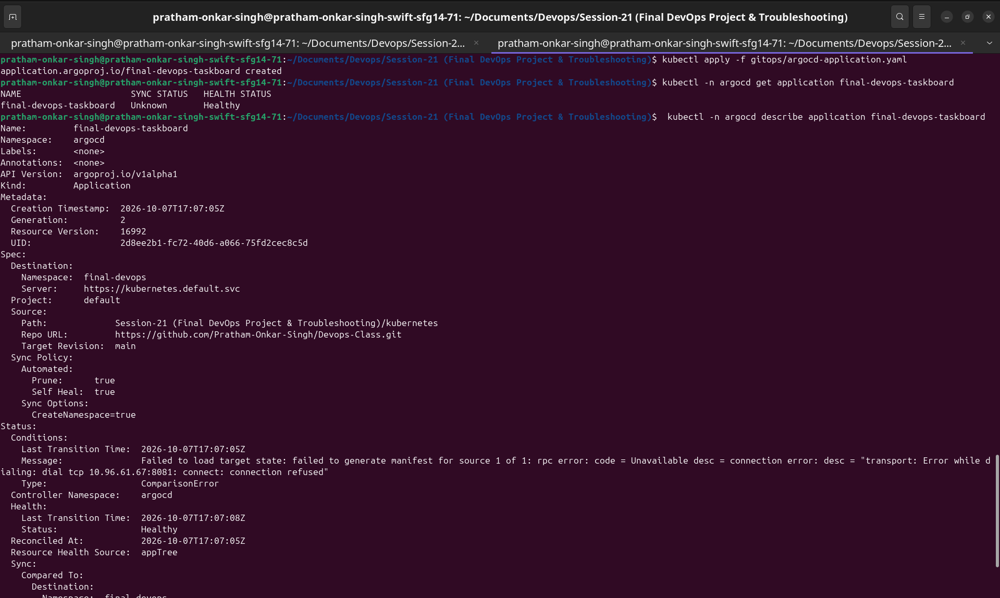

## 10. Final troubleshooting challenge

The `troubleshooting/broken/` directory contains safe, intentionally broken examples that are not part of the normal deployment:

| Failure | Symptom | Root cause | Fix |
|---|---|---|---|
| ImagePullBackOff | `ErrImagePull` / `ImagePullBackOff` | Invalid image tag and pull policy | Load or publish the valid image |
| Configuration failure | Pod cannot create its container | Missing ConfigMap reference | Reference `taskboard-config` |

Investigation uses the Kubernetes evidence chain:

```bash
kubectl get pods
kubectl describe pod <pod-name>
kubectl logs <pod-name> --previous
kubectl get events --sort-by=.lastTimestamp
kubectl get deployment,svc,configmap,secret,hpa,pvc
```

The troubleshooting record is in [troubleshooting/README.md](troubleshooting/README.md).

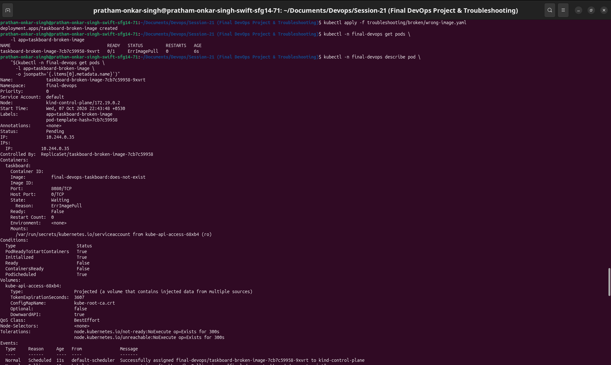

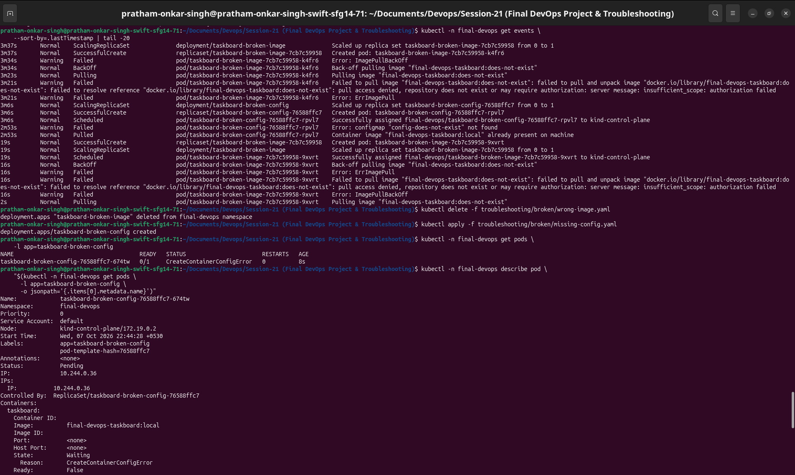

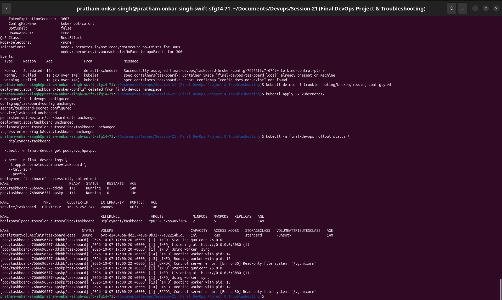

## Lessons learned

- Keep application configuration outside the image and separate secrets from source code.
- Treat SAST, SCA, secret scanning, and image scanning as release gates.
- Use resource requests, probes, and HPA metrics together.
- Use Helm for repeatable packaging and GitOps for continuous reconciliation.
- Troubleshoot from symptoms through events, logs, configuration, root cause, fix, and verification.

## Cleanup

```bash
helm uninstall taskboard -n final-devops || true
kubectl delete namespace final-devops --ignore-not-found
cd terraform
terraform destroy
```
