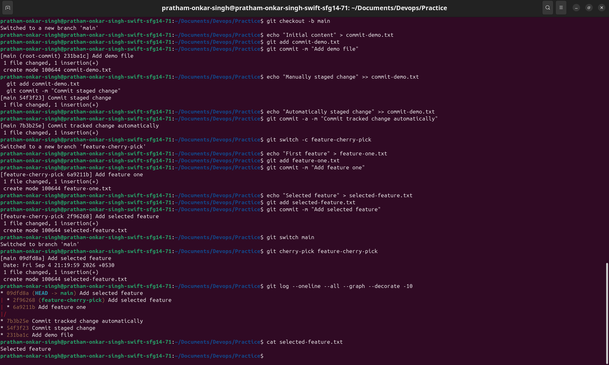

# Git Homework

## 1. `git commit -m` vs `git commit -a -m`

- **`git commit -m "message"`** commits only the changes that have already been added to the staging area with `git add`. Modified files that have not been staged are not included.
- **`git commit -a -m "message"`** automatically stages and commits modified or deleted **tracked** files. It does not include new, untracked files.

## 2. Cherry-Picking Exercise

For this exercise, I created commits on the `main` branch, created a new branch, made more commits there, and cherry-picked one specific commit back into `main`.

The screenshot below shows the commands and output used to test both commit commands and verify the cherry-pick:

