# Docker Fundamentals Homework

This assignment demonstrates simple **Hello World** web applications running in Docker containers.

## 1. Node.js Application

A simple Node.js application that displays a **Hello World from Node.js!** message.

**How to run:**

```bash
cd nodejs-app
docker build -t nodejs-hello-world .
docker run -d --name nodejs-hello -p 3000:3000 nodejs-hello-world
docker ps
```

Open `http://localhost:3000` in your browser.

**Screenshots:**

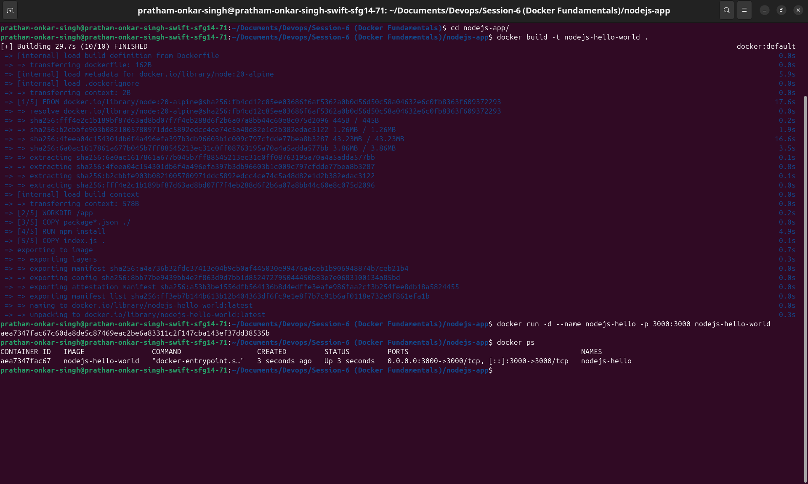


Stop and remove the container after verification:

```bash
docker stop nodejs-hello
docker rm nodejs-hello
```

---

## 2. Python Application

A simple Python Flask application that displays a **Hello World from Python!** message.

**How to run:**

```bash
cd ../python-app
docker build -t python-hello-world .
docker run -d --name python-hello -p 5000:5000 python-hello-world
docker ps
```

Open `http://localhost:5000` in your browser.

**Screenshots:**

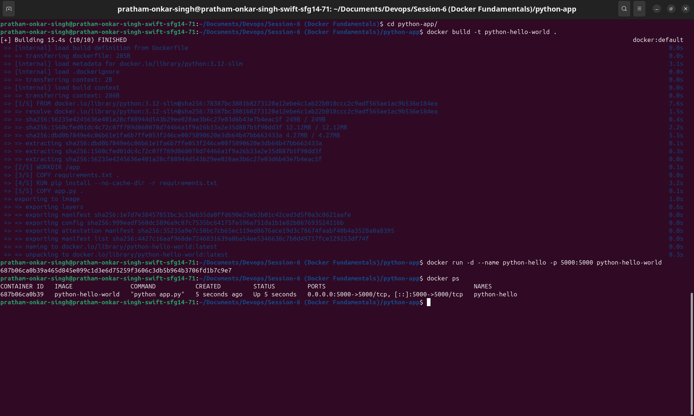
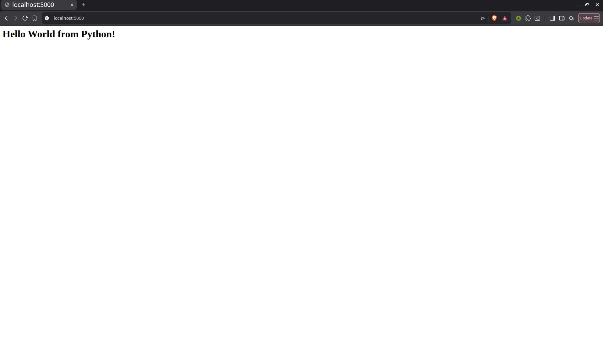

Stop and remove the container after verification:

```bash
docker stop python-hello
docker rm python-hello
```

---

## 3. Java Application

A simple Java HTTP server that displays a **Hello World from Java!** message.

**How to run:**

```bash
cd ../java-app
docker build -t java-hello-world .
docker run -d --name java-hello -p 8080:8080 java-hello-world
docker ps
```

Open `http://localhost:8080` in your browser.

**Screenshots:**

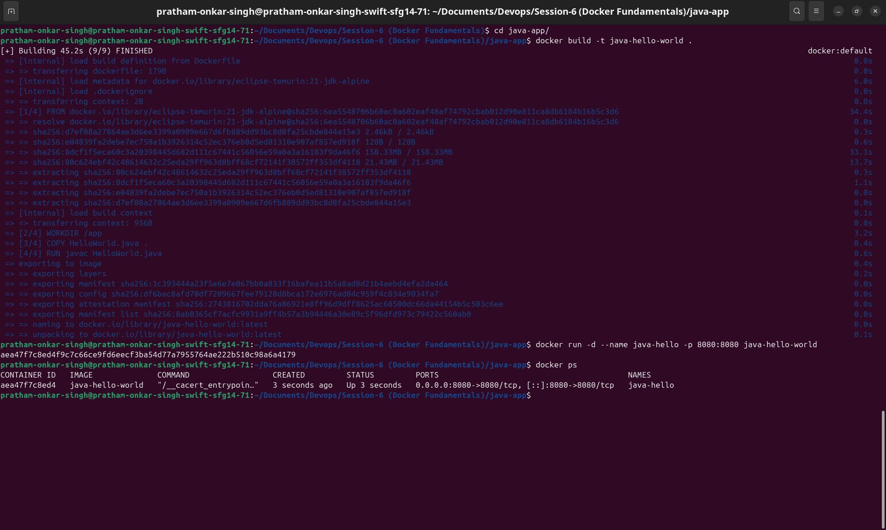
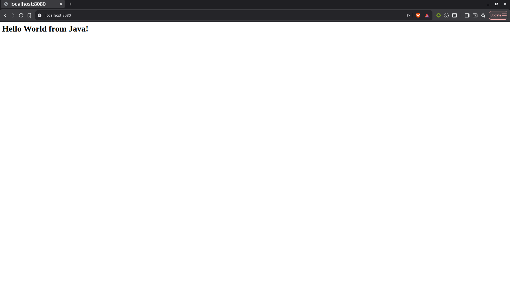

Stop and remove the container after verification:

```bash
docker stop java-hello
docker rm java-hello
```

---

## 4. Apache Web Server

A basic Apache HTTP server that displays a **Hello World from Apache!** webpage.

**How to run:**

```bash
cd ../apache-app
docker build -t apache-hello-world .
docker run -d --name apache-hello -p 8081:80 apache-hello-world
docker ps
```

Open `http://localhost:8081` in your browser.

**Screenshots:**

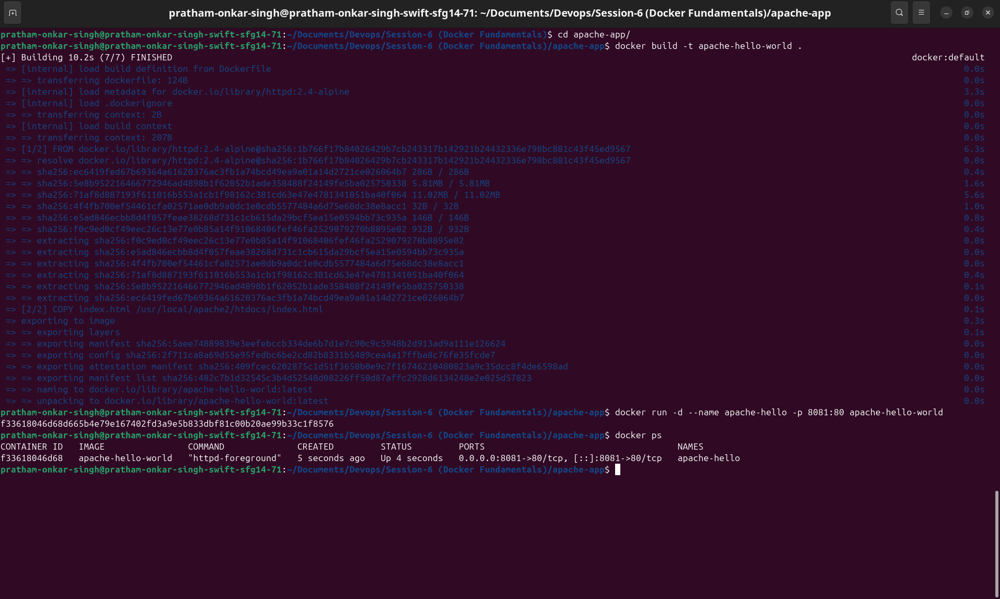
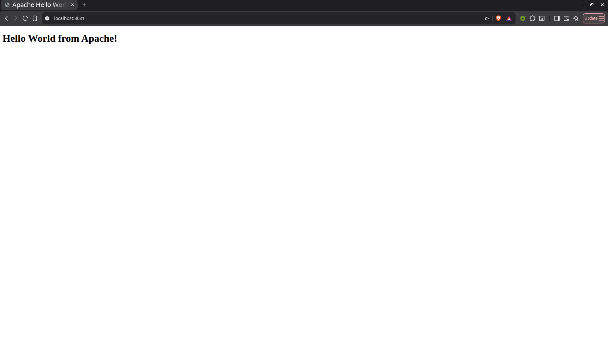

Stop and remove the container after verification:

```bash
docker stop apache-hello
docker rm apache-hello
```

---

## 5. React Application

A simple React application that displays a **Hello World from React!** message.

**How to run:**

```bash
cd ../React-app
docker build -t react-hello-world .
docker run -d --name react-hello -p 3001:3000 react-hello-world
docker ps
```

Open `http://localhost:3001` in your browser.

**Screenshots:**

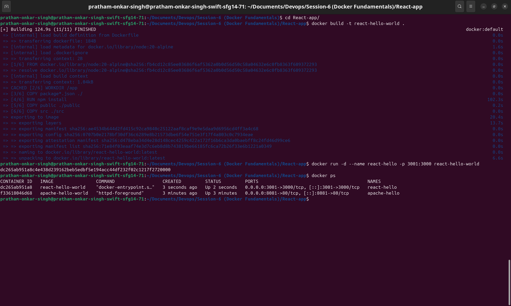
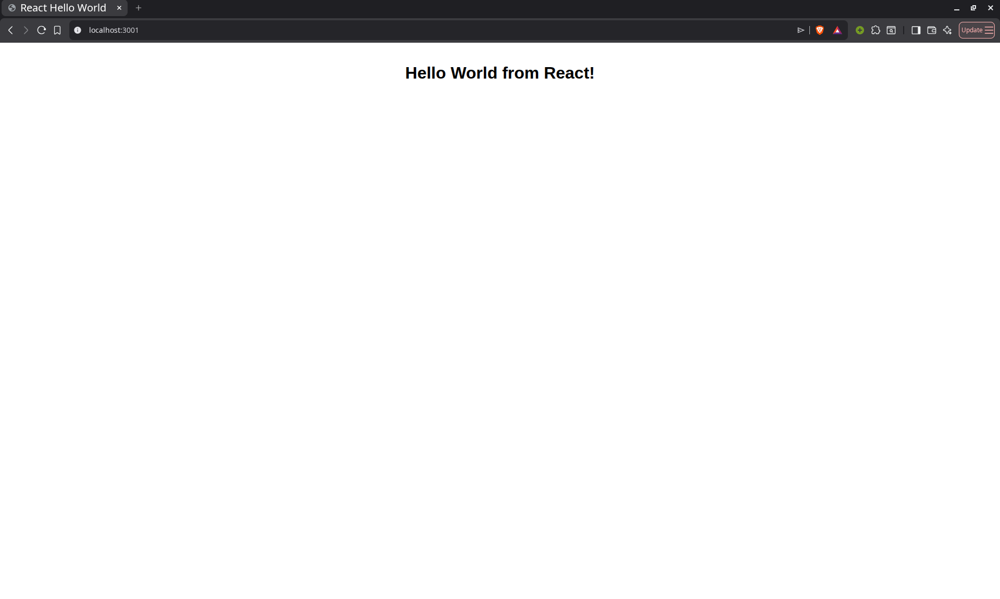

Stop and remove the container after verification:

```bash
docker stop react-hello
docker rm react-hello
```

---

## 6. Nginx Application

A basic Nginx server that displays a **Hello World from Nginx!** webpage.

**How to run:**

```bash
cd ../nginx-app
docker build -t nginx-hello-world .
docker run -d --name nginx-hello -p 8082:80 nginx-hello-world
docker ps
```

Open `http://localhost:8082` in your browser.

**Screenshots:**

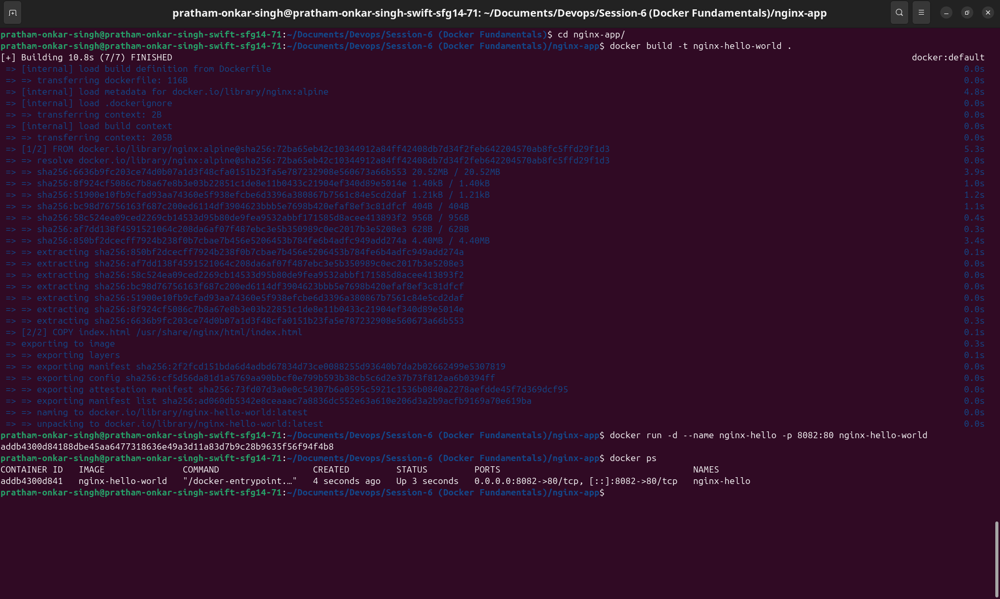
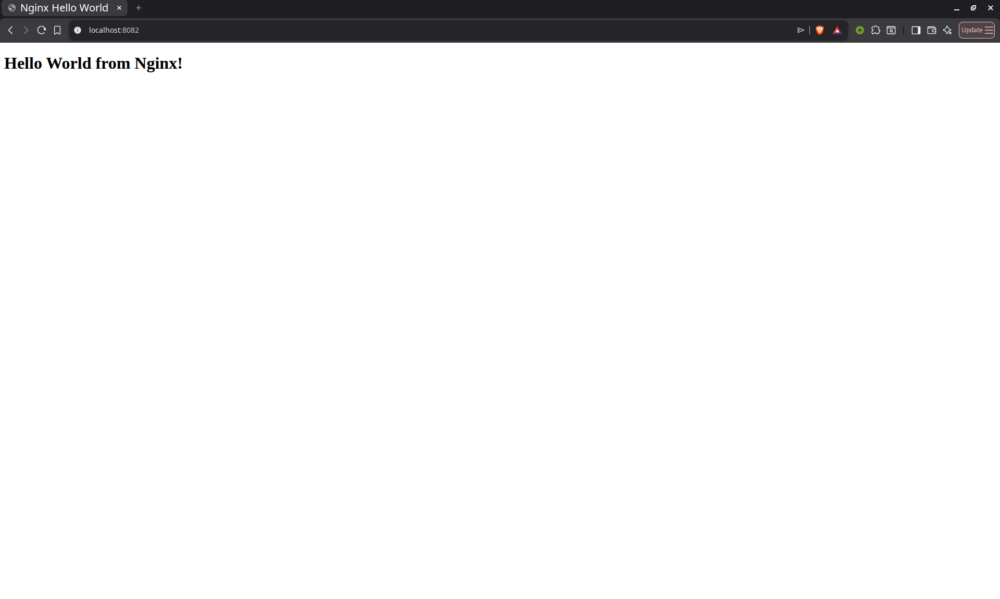

Stop and remove the container after verification:

```bash
docker stop nginx-hello
docker rm nginx-hello
```

---

## Folder Structure

```text
Docker Fundamentals/
├── nodejs-app/
├── python-app/
├── java-app/
├── apache-app/
├── React-app/
├── nginx-app/
├── screenshot1.png
├── screenshot2.png
├── ...
├── screenshot12.png
└── README.md
```
