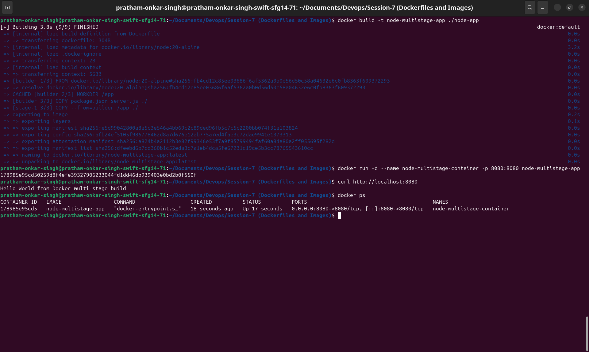
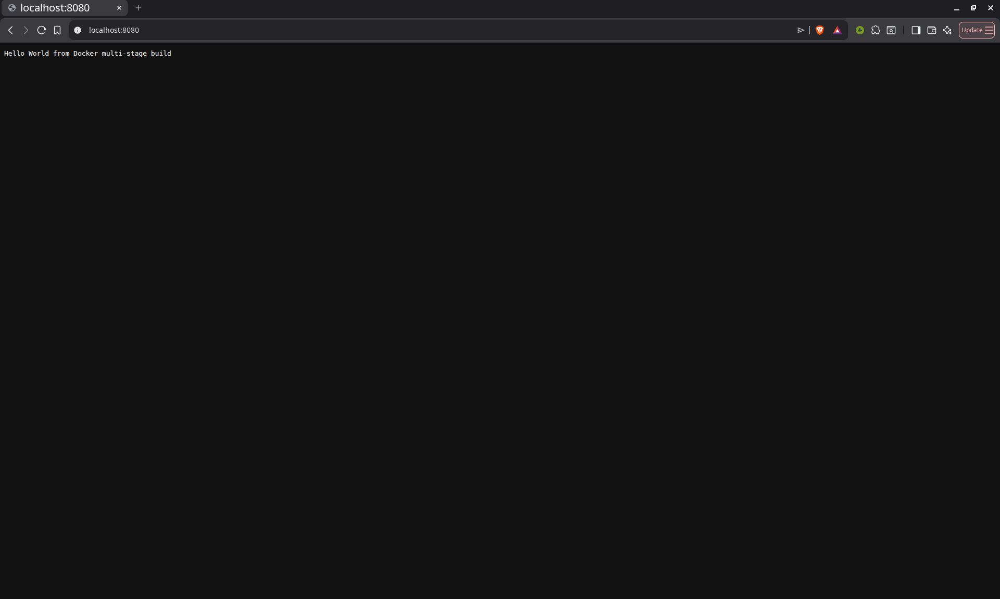
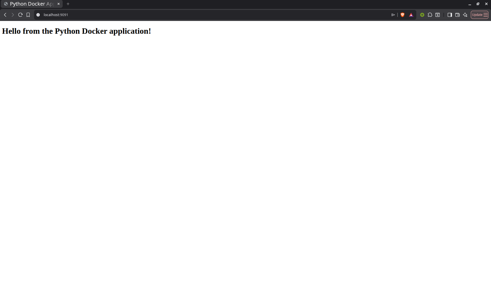
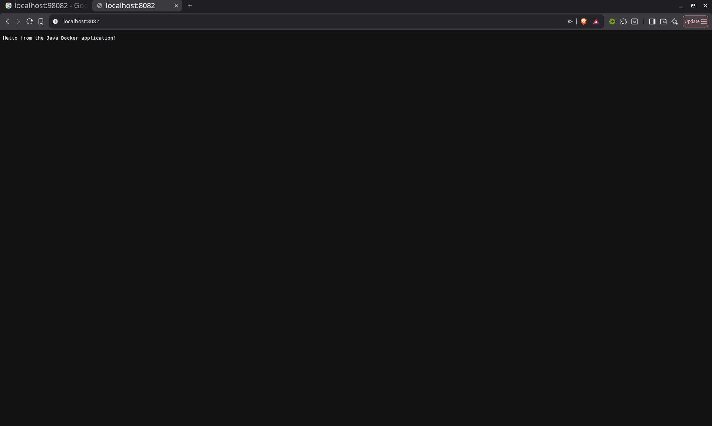

# Docker Applications Homework

**Name:** Pratham Onkar Singh

**Roll No.:** 24bcs10136

## Task 1 & 2: Multi-Stage Node.js Application

The Node.js application uses a multi-stage Dockerfile and runs on port 8080.

### Docker Build and Run

```bash
docker build -t node-multistage-app ./node-app
docker run -d --name node-multistage-container -p 8080:8080 node-multistage-app
curl http://localhost:8080
docker ps
```

The application displays `Hello World from Docker multi-stage build`, and the
container is mapped to port 8080.



### Node.js Application Output



---

## Task 3: Deploy Three Different Types of Applications

The three Dockerized applications are Node.js, Python, and Java.

### Application 1: Node.js

The Node.js application is shown above and runs on port 8080.

### Application 2: Python Web Server

```bash
docker build -t python-app ./python-app
docker run -d --name python-container -p 9091:9091 python-app
```

Open <http://localhost:9091> in a browser.



### Application 3: Java Web Server

```bash
docker build -t java-app ./java-app
docker run -d --name java-container -p 8082:8082 java-app
```

Open <http://localhost:8082> in a browser.



## Cleanup

You can stop and remove the containers using this command:

```bash
docker rm -f node-multistage-container python-container java-container
```
