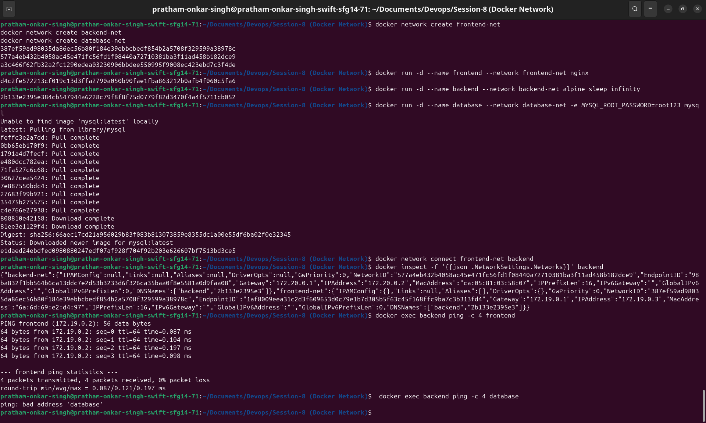
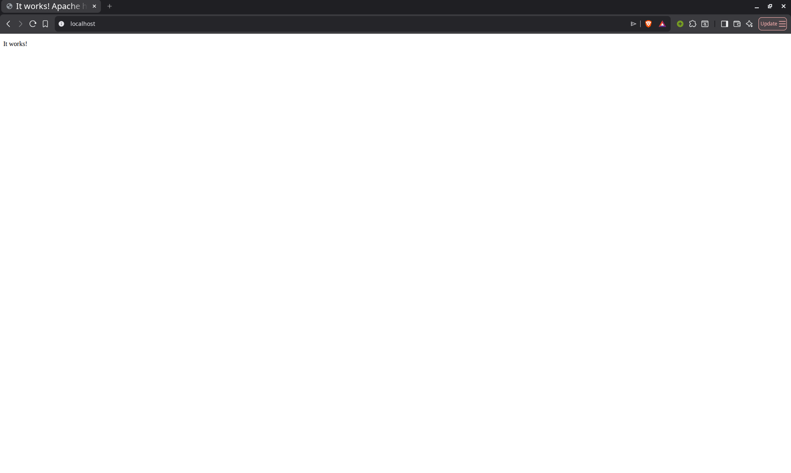
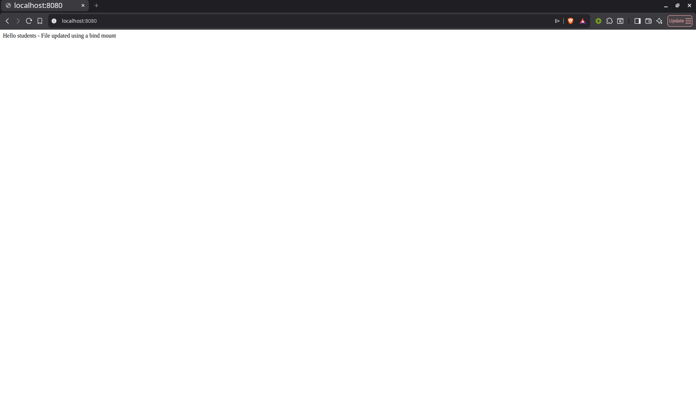

# Docker Networking & Volume Homework

This repository contains the completed Docker networking and bind mount assignment.

## Task 1: Docker Container Networking

I created three containers and three bridge networks. The backend container is connected to two networks (`frontend-net` and `backend-net`), while the database is isolated on `database-net`.

### Steps

Create the networks:

```bash
docker network create frontend-net
docker network create backend-net
docker network create database-net
```

Create the containers:

```bash
docker run -d --name frontend --network frontend-net nginx
docker run -d --name backend --network backend-net alpine sleep infinity
docker run -d --name database --network database-net -e MYSQL_ROOT_PASSWORD=root123 mysql
```

Connect the backend to its second network:

```bash
docker network connect frontend-net backend
```

Check the containers and networks:

```bash
docker ps
docker network inspect frontend-net
docker network inspect backend-net
docker network inspect database-net
```

Test connectivity. The frontend ping should succeed because it shares `frontend-net` with the backend. The database ping should fail because it is isolated on `database-net`.

```bash
docker exec backend ping -c 4 frontend
docker exec backend ping -c 4 database
```

### Result

The backend successfully communicated with the frontend. It could not reach the database because they do not share a network.



## Task 2: Host Network

I used the official Apache HTTP Server image (`httpd`) and ran it with the host network.

### Steps

```bash
docker pull httpd
docker run -d --name apache-host --network host httpd
docker ps
```

Open [http://localhost](http://localhost) in a browser. The page should display **It works!**.

### Result

Apache was available directly on the host's port 80 without publishing a port with `-p`.



Stop Apache before starting Task 3 so that it does not remain on port 80:

```bash
docker stop apache-host
```

## Task 3: Bind Mount

The local [`html/index.html`](html/index.html) file initially contains `Hello students`. I bind mounted the `html` directory into an Nginx container.

### Steps

From this repository directory, run:

```bash
docker run -d --name nginx-bind -p 8080:80 -v "$(pwd)/html:/usr/share/nginx/html:ro" nginx
docker ps
```

Open [http://localhost:8080](http://localhost:8080). It should display **Hello students**.


Edit `html/index.html` and change its contents to:

```html
Hello students - File updated using a bind mount
```

Save the file and refresh [http://localhost:8080](http://localhost:8080). The new content should appear without restarting the container.



### Result

Changes made to the local file appeared immediately inside the Nginx website, confirming that the bind mount works.

## Task 4: Overlay Network

### What is an overlay network?

A Docker overlay network connects containers or services running on different Docker hosts. It creates one virtual network over the hosts' existing physical networks.

### Use cases

- Connecting Docker Swarm services running on multiple hosts
- Allowing containers on separate servers to communicate
- Keeping application traffic separate from the physical network layout

### How does it work across hosts?

Docker uses VXLAN tunnelling to wrap container network traffic and send it between Docker hosts. The receiving host unwraps the traffic and passes it to the correct container. Docker Swarm manages which hosts and services belong to the overlay network.

