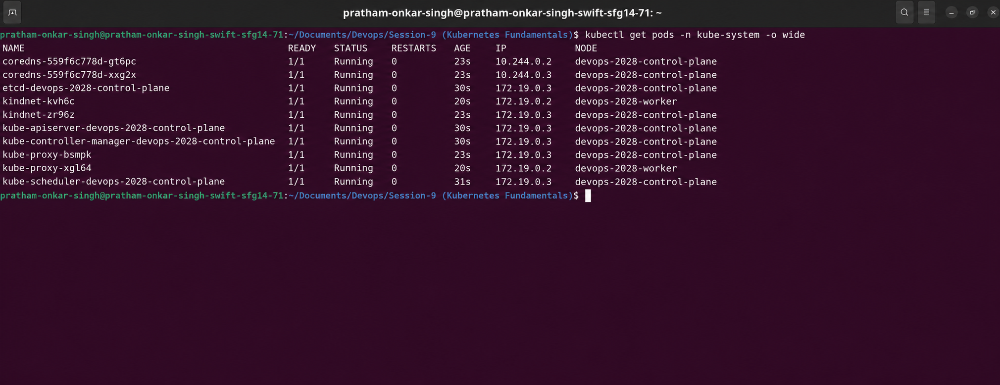
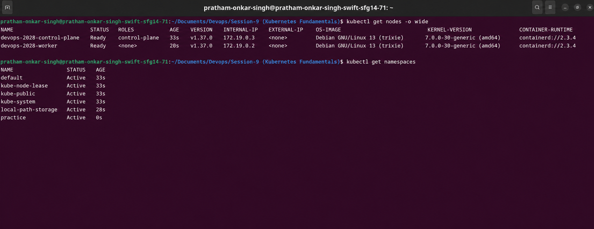
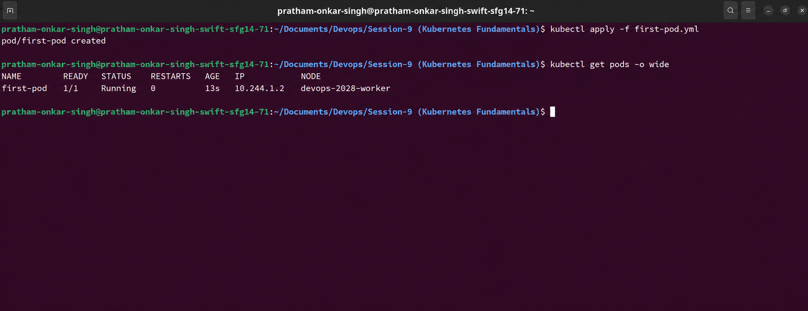
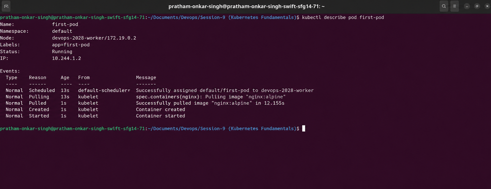

# Kubernetes Fundamentals

**Student:** Pratham Onkar Singh
**Roll No.:** 24bcs10136

## Assignment objectives

This exercise covers the basic pieces of a Kubernetes cluster: its architecture, a local
cluster created with kind, namespaces, cluster inspection through `kubectl`, and a first
Pod.

## Local environment

I used [kind](https://kind.sigs.k8s.io/) (Kubernetes in Docker) for a lightweight local
cluster. It creates Kubernetes nodes as Docker containers. The configuration in
[kind-cluster.yml](kind-cluster.yml) defines one control-plane node and one worker node.

```bash
kind create cluster --config kind-cluster.yml
kubectl cluster-info
kubectl get nodes -o wide
```

The exposed host ports in the kind configuration are reserved for a later ingress exercise.
When kind completes, it automatically makes its cluster the active `kubectl` context.

## What Kubernetes does

Kubernetes is a container orchestration platform. Instead of manually starting and
restarting individual containers, I declare the desired result—for example, an application
with a chosen image and number of replicas. Kubernetes continuously compares that desired
state with what is actually running and works to reconcile any difference. This is the
declarative model.

## Cluster architecture

Kubernetes separates decision-making from application execution. The control plane manages
the cluster, while worker nodes run the workload Pods.

| Component | Location | Responsibility |
| --- | --- | --- |
| `kube-apiserver` | Control plane | API entry point used by `kubectl` and other clients. |
| `etcd` | Control plane | Key-value store for cluster configuration and state. |
| `kube-scheduler` | Control plane | Selects a suitable node for a newly created Pod. |
| `kube-controller-manager` | Control plane | Runs controllers that move actual state toward desired state. |
| `kubelet` | Every node | Ensures the containers assigned to its node are running. |
| `kube-proxy` | Every node | Maintains network rules used by Services. |
| `containerd` | Every node | Container runtime that starts containers. |
| CoreDNS | Cluster add-on | Lets Pods resolve Service names through DNS. |

The control-plane services can be inspected as Pods:

```bash
kubectl get pods -n kube-system -o wide
```

I expect `etcd`, `kube-apiserver`, `kube-controller-manager`, and `kube-scheduler` on the
control-plane node. Network components such as `kube-proxy` and kind's CNI component should
have one instance per node.



## Checking the cluster

```bash
kubectl version
kubectl cluster-info
kubectl get nodes -o wide
```

`kubectl get nodes -o wide` shows node readiness, roles, IP addresses, OS information, and
the runtime. A healthy two-node kind cluster reports both nodes as `Ready`; the control-plane
node is labelled `control-plane`, while the worker normally has no control-plane role.

Immediately after cluster creation, nodes can briefly display `NotReady` while the CNI
network is starting. Waiting a short time and checking again should show `Ready`.



## Namespaces

Namespaces divide a single cluster into logical scopes. They prevent naming collisions and
help organise system resources separately from application resources.

```bash
kubectl get namespaces
kubectl create namespace practice
kubectl get namespaces
```

| Namespace | Purpose |
| --- | --- |
| `default` | Default destination for objects without an explicit namespace. |
| `kube-system` | Kubernetes system components and add-ons. |
| `kube-public` | A namespace intended to be readable by all users. |
| `kube-node-lease` | Stores node heartbeat lease objects. |
| `local-path-storage` | Local storage provisioner installed by kind. |
| `practice` | Namespace created during this exercise. |

By default, `kubectl get pods` only shows the current namespace. Use `-n kube-system` to
view a particular namespace, or `-A` to view resources throughout the cluster.

## First Pod

A Pod is Kubernetes' smallest deployable unit. It may contain one or more containers that
share networking and storage; this exercise uses one NGINX container.

The manifest is [first-pod.yml](first-pod.yml):

```yaml
apiVersion: v1
kind: Pod
metadata:
  name: first-pod
  labels:
    app: first-pod
spec:
  containers:
    - name: nginx
      image: nginx:alpine
      ports:
        - containerPort: 80
```

The key sections in a Kubernetes manifest are `apiVersion` (API group/version), `kind`
(resource type), `metadata` (identity and labels), and `spec` (the requested configuration).

```bash
kubectl apply -f first-pod.yml
kubectl get pods -o wide
kubectl describe pod first-pod
kubectl logs first-pod
```

Once the Pod is running, `READY 1/1` indicates its only container is ready. The `describe`
output is especially useful for troubleshooting: its Events section records the scheduler's
placement decision, image pull, container creation, and container start. `kubectl logs`
displays the NGINX container logs.





## Evidence to capture

The following screenshots were captured from the terminal after running the commands above.
They are intentionally not copied from another student's environment: node names,
addresses, versions, and timestamps naturally differ by machine.

| File | Command(s) visible in the capture |
| --- | --- |
| `screenshots/cluster-and-namespaces.png` | `kubectl get nodes -o wide` and `kubectl get namespaces` |
| `screenshots/kube-system-pods.png` | `kubectl get pods -n kube-system -o wide` |
| `screenshots/first-pod.png` | `kubectl apply -f first-pod.yml` and `kubectl get pods -o wide` |
| `screenshots/describe-pod-events.png` | `kubectl describe pod first-pod`, with the Events section visible |

## Command reference

| Command | Use |
| --- | --- |
| `kubectl version` | Show client and server versions. |
| `kubectl cluster-info` | Display control-plane and DNS endpoints. |
| `kubectl get nodes` | List cluster nodes. |
| `kubectl get pods -A` | List Pods across all namespaces. |
| `kubectl get namespaces` | List namespaces. |
| `kubectl create namespace <name>` | Create a namespace. |
| `kubectl apply -f <file>` | Create or update from a manifest. |
| `kubectl describe pod <name>` | Inspect Pod details and events. |
| `kubectl logs <name>` | Read container logs. |
| `kubectl exec -it <name> -- sh` | Open a shell inside a container. |
| `kubectl delete -f <file>` | Remove the resources described by a manifest. |

## Takeaways

- Kubernetes uses declarative configuration and reconciliation loops.
- Control-plane components make scheduling and management decisions; workers execute Pods.
- Namespaces provide useful boundaries inside one cluster.
- Pod Events are one of the first places to investigate when a workload fails to start.
